### 字节码、类加载器、虚拟机

#### 字节码技术
Java bytecode 由单字节(byte)的指令组成，理论上最多支持 256 个操作码(opcode)。 实际上 Java 只使用了200左右的操作码， 还有一些操作码则保留给调试操作。

根据指令的性质，主要分为四个大类:
```text
1. 栈操作指令，包括与局部变量交互的指令
 
2. 程序流程控制指令

3. 对象操作指令，包括方法调用指令

4. 算术运算以及类型转换指令
```
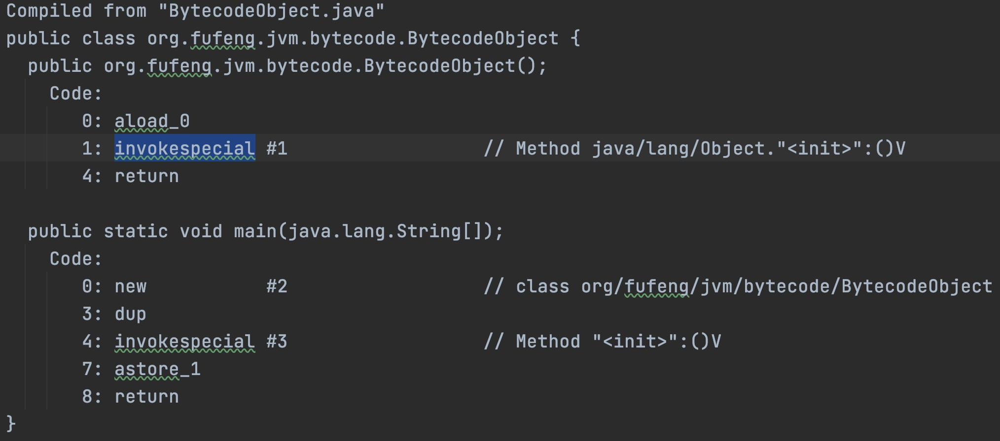

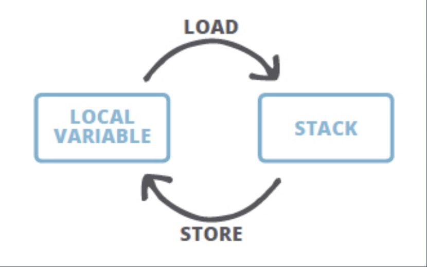

#### 字节码运行时结构
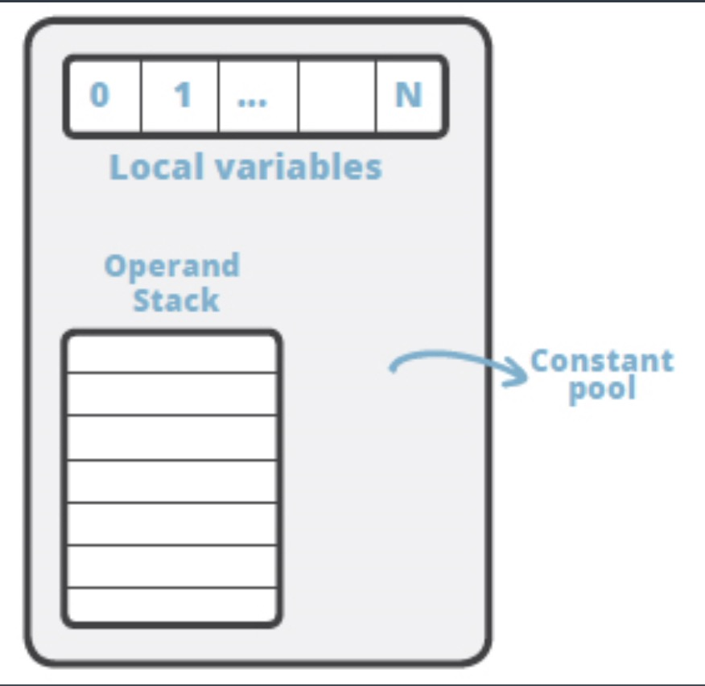
```text
JVM 是一台基于栈的计算机器。 

每个线程都有一个独属于自己的线程栈(JVM Stack)，用于存储栈帧(Frame)。

每一次方法调用，JVM 都会自动创建一个栈帧。 

栈帧由操作数栈， 局部变量数组以及一个 Class 引用组成。
 
Class 引用 指向当前方法在运行时常量池中对应的 Class。
```

#### 助记符到二进制(org.fufeng.jvm.bytecode.demo01)
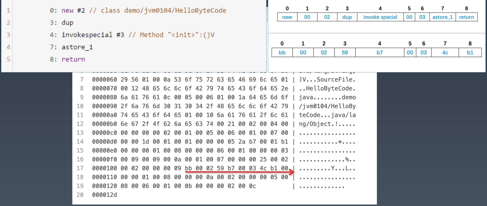

#### 四则运行(org.fufeng.jvm.bytecode.demo02)
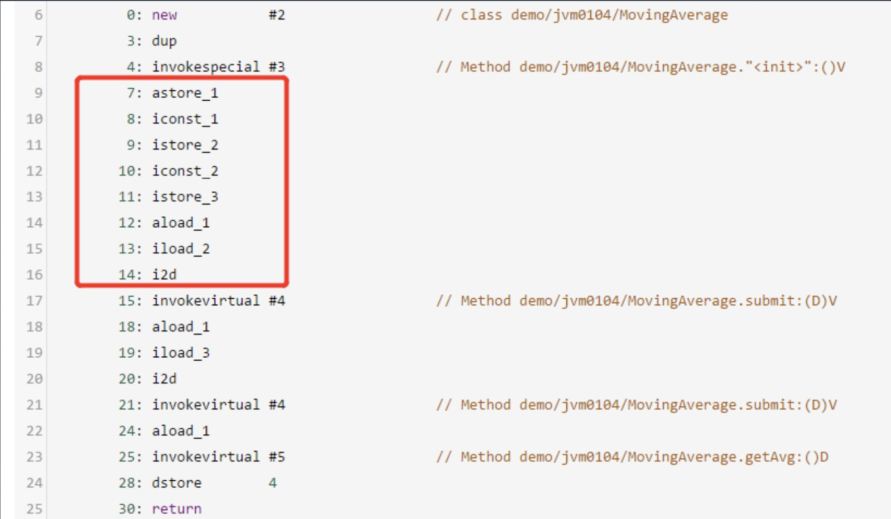
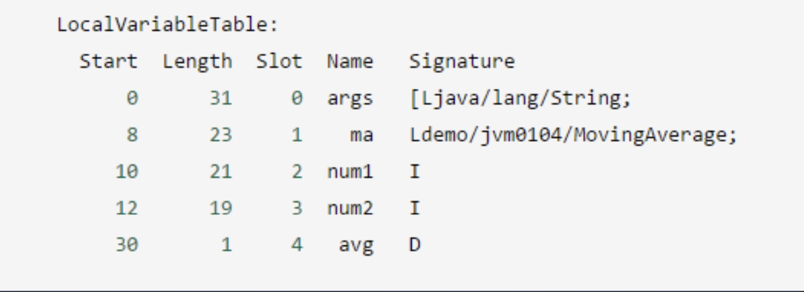

#### 算数操作与类型转换
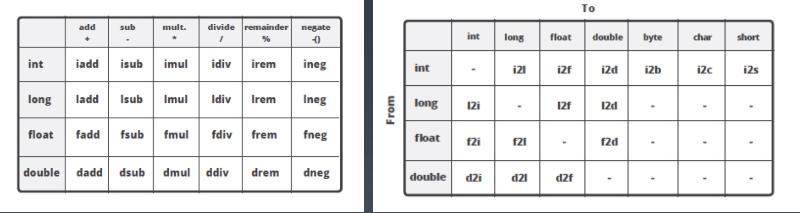

#### 循环控制例子(org.fufeng.jvm.bytecode.demo03)
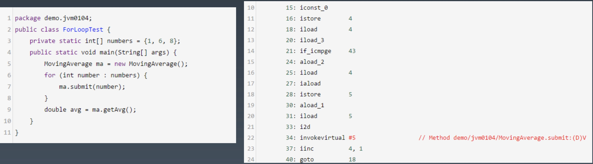

#### 方法调用的指令
```text
invokestatic，顾名思义，这个指令用于调用某个类的静态方法，这是方法调用指令中最 快的一个。

invokespecial, 用来调用构造函数，但也可以用于调用同一个类中的 private 方法, 以及 可见的超类方法。

invokevirtual，如果是具体类型的目标对象，invokevirtual 用于调用公共，受保护和 package 级的私有方法。

invokeinterface，当通过接口引用来调用方法时，将会编译为 invokeinterface 指令。

invokedynamic，JDK7 新增加的指令，是实现“动态类型语言”(Dynamically Typed Language)支持而进行的升级改进，同时也是 JDK8 以后支持 lambda 表达式的实现基础。
```

#### 例子
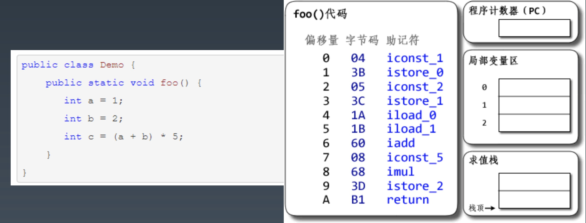

### JVM 类加载器

#### 类的生命周期
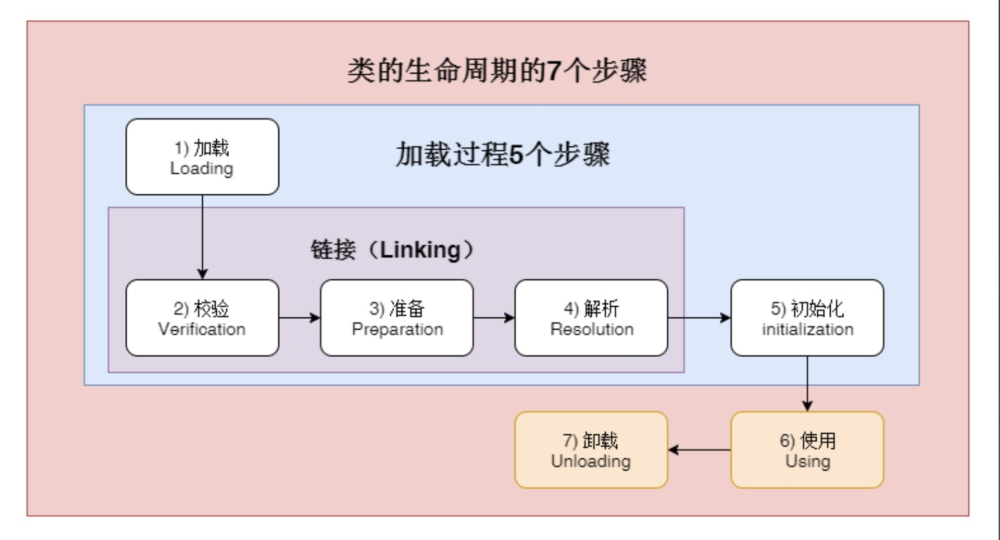
```text
1. 加载(Loading):找 Class 文件
2. 验证(Verification):验证格式、依赖
3. 准备(Preparation):静态字段、方法表
4. 解析(Resolution):符号解析为引用
5. 初始化(Initialization):构造器、静态变 量赋值、静态代码块
6. 使用(Using)
7. 卸载(Unloading)
```

#### 类的加载时机
```text
1. 当虚拟机启动时，初始化用户指定的主类，就是启动执行的 main 方法所在的类;
2. 当遇到用以新建目标类实例的 new 指令时，初始化 new 指令的目标类，就是 new 一个类的时候要初始化;
3. 当遇到调用静态方法的指令时，初始化该静态方法所在的类;
4. 当遇到访问静态字段的指令时，初始化该静态字段所在的类;
5. 子类的初始化会触发父类的初始化;
6. 如果一个接口定义了 default 方法，那么直接实现或者间接实现该接口的类的初始化， 会触发该接口的初始化;
7. 使用反射 API 对某个类进行反射调用时，初始化这个类，其实跟前面一样，反射调用 要么是已经有实例了，要么是静态方法，都需要初始化;
8. 当初次调用 MethodHandle 实例时，初始化该 MethodHandle 指向的方法所在的 类。
```

#### 不会初始化(可能会加载)
```text
1. 通过子类引用父类的静态字段，只会触发父类的初始化，而不会触发子类的初始化。
2. 定义对象数组，不会触发该类的初始化。
3. 常量在编译期间会存入调用类的常量池中，本质上并没有直接引用定义常量的类，不 会触发定义常量所在的类。
4. 通过类名获取 Class 对象，不会触发类的初始化，Hello.class 不会让 Hello 类初始 化。
5. 通过 Class.forName 加载指定类时，如果指定参数 initialize 为 false 时，也不会触 发类初始化，其实这个参数是告诉虚拟机，是否要对类进行初始化。Class.forName (“jvm.Hello”)默认会加载 Hello 类。
6. 通过 ClassLoader 默认的 loadClass 方法，也不会触发初始化动作(加载了，但是 不初始化)。
```

#### 三类类加载器
```text
1. 启动类加载器(BootstrapClassLoader) 
2. 扩展类加载器(ExtClassLoader)
3. 应用类加载器(AppClassLoader)
```
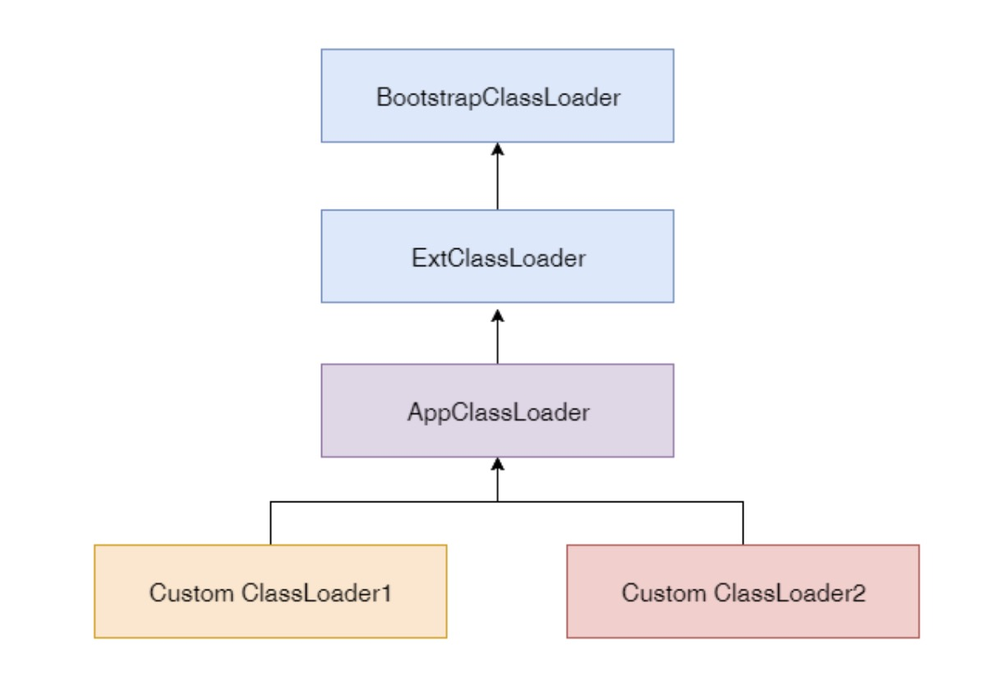

#### 加载器特点
```text
1. 双亲委托 
2. 负责依赖 
3. 缓存加载
```


#### 显示当前 ClassLoader 加载了哪些 Jar? (org.fufeng.jvm.classloader.demo01)

#### 自定义 ClassLoader(org.fufeng.jvm.classloader.demo02)

#### 添加引用类的几种方式
```text
1、放到 JDK 的 lib/ext 下，或者-Djava.ext.dirs
2、 java –cp/classpath 或者 class 文件放到当前路径
3、自定义 ClassLoader 加载
4、拿到当前执行类的 ClassLoader，反射调用 addUrl 方法添加 Jar 或路径(JDK9 无效)。
```


