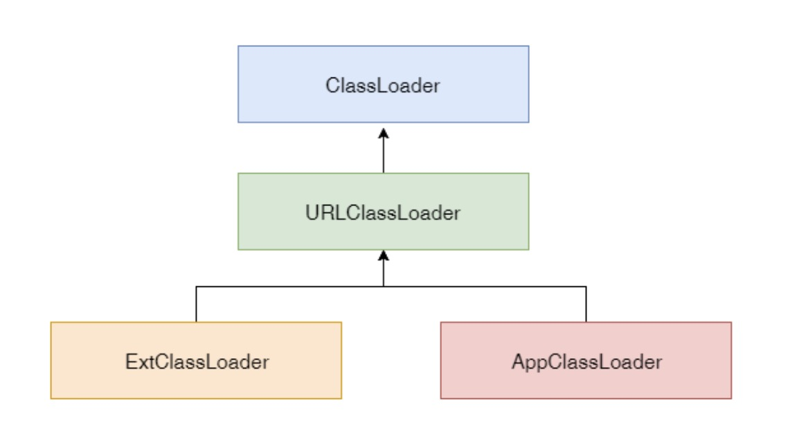

### 字节码、类加载器、虚拟机

#### 字节码技术
Java bytecode 由单字节(byte)的指令组成，理论上最多支持 256 个操作码(opcode)。 实际上 Java 只使用了200左右的操作码， 还有一些操作码则保留给调试操作。

根据指令的性质，主要分为四个大类:
```text
1. 栈操作指令，包括与局部变量交互的指令
 
2. 程序流程控制指令

3. 对象操作指令，包括方法调用指令

4. 算术运算以及类型转换指令
```


#### 字节码运行时结构

```text
JVM 是一台基于栈的计算机器。 

每个线程都有一个独属于自己的线程栈(JVM Stack)，用于存储栈帧(Frame)。

每一次方法调用，JVM 都会自动创建一个栈帧。 

栈帧由操作数栈， 局部变量数组以及一个 Class 引用组成。
 
Class 引用 指向当前方法在运行时常量池中对应的 Class。
```

#### 助记符到二进制(org.fufeng.jvm.bytecode.demo01)


#### 四则运行(org.fufeng.jvm.bytecode.demo02)


#### 算数操作与类型转换


#### 循环控制例子(org.fufeng.jvm.bytecode.demo03)


#### 方法调用的指令
```text
invokestatic，顾名思义，这个指令用于调用某个类的静态方法，这是方法调用指令中最 快的一个。

invokespecial, 用来调用构造函数，但也可以用于调用同一个类中的 private 方法, 以及 可见的超类方法。

invokevirtual，如果是具体类型的目标对象，invokevirtual 用于调用公共，受保护和 package 级的私有方法。

invokeinterface，当通过接口引用来调用方法时，将会编译为 invokeinterface 指令。

invokedynamic，JDK7 新增加的指令，是实现“动态类型语言”(Dynamically Typed Language)支持而进行的升级改进，同时也是 JDK8 以后支持 lambda 表达式的实现基础。
```

#### 例子


### JVM 类加载器

#### 类的生命周期

```text
1. 加载(Loading):找 Class 文件
2. 验证(Verification):验证格式、依赖
3. 准备(Preparation):静态字段、方法表
4. 解析(Resolution):符号解析为引用
5. 初始化(Initialization):构造器、静态变 量赋值、静态代码块
6. 使用(Using)
7. 卸载(Unloading)
```

#### 类的加载时机
```text
1. 当虚拟机启动时，初始化用户指定的主类，就是启动执行的 main 方法所在的类;
2. 当遇到用以新建目标类实例的 new 指令时，初始化 new 指令的目标类，就是 new 一个类的时候要初始化;
3. 当遇到调用静态方法的指令时，初始化该静态方法所在的类;
4. 当遇到访问静态字段的指令时，初始化该静态字段所在的类;
5. 子类的初始化会触发父类的初始化;
6. 如果一个接口定义了 default 方法，那么直接实现或者间接实现该接口的类的初始化， 会触发该接口的初始化;
7. 使用反射 API 对某个类进行反射调用时，初始化这个类，其实跟前面一样，反射调用 要么是已经有实例了，要么是静态方法，都需要初始化;
8. 当初次调用 MethodHandle 实例时，初始化该 MethodHandle 指向的方法所在的 类。
```

#### 不会初始化(可能会加载)
```text
1. 通过子类引用父类的静态字段，只会触发父类的初始化，而不会触发子类的初始化。
2. 定义对象数组，不会触发该类的初始化。
3. 常量在编译期间会存入调用类的常量池中，本质上并没有直接引用定义常量的类，不 会触发定义常量所在的类。
4. 通过类名获取 Class 对象，不会触发类的初始化，Hello.class 不会让 Hello 类初始 化。
5. 通过 Class.forName 加载指定类时，如果指定参数 initialize 为 false 时，也不会触 发类初始化，其实这个参数是告诉虚拟机，是否要对类进行初始化。Class.forName (“jvm.Hello”)默认会加载 Hello 类。
6. 通过 ClassLoader 默认的 loadClass 方法，也不会触发初始化动作(加载了，但是 不初始化)。
```

#### 三类类加载器
```text
1. 启动类加载器(BootstrapClassLoader) 
2. 扩展类加载器(ExtClassLoader)
3. 应用类加载器(AppClassLoader)
```


#### 加载器特点
```text
1. 双亲委托 
2. 负责依赖 
3. 缓存加载
```


#### 显示当前 ClassLoader 加载了哪些 Jar? (org.fufeng.jvm.classloader.demo01)

#### 自定义 ClassLoader(org.fufeng.jvm.classloader.demo02)

#### 添加引用类的几种方式
```text
1、放到 JDK 的 lib/ext 下，或者-Djava.ext.dirs
2、 java –cp/classpath 或者 class 文件放到当前路径
3、自定义 ClassLoader 加载
4、拿到当前执行类的 ClassLoader，反射调用 addUrl 方法添加 Jar 或路径(JDK9 无效)。
```

#### JVM 内存模型

#### JVM内存结构

```text
每个线程都只能访问自己的线程栈。
每个线程都不能访问(看不见)其他线程的局部变量。
所有原生类型的局部变量都存储在线程栈中，因此对其他线程是不可见的。
线程可以将一个原生变量值的副本传给另一个线程，但不能共享原生局部变量本身。
堆内存中包含了 Java 代码中创建的所有对象，不管是哪个线程创建的。 其中也涵盖了包装类型 (例如 Byte，Integer，Long 等)。
不管是创建一个对象并将其赋值给局部变量， 还是赋值给另一个对象的成员变量， 创建的对象都会被保存到堆内存中。
```


```text
如果是原生数据类型的局部变量，那么它的内容就全部保留在线程栈上。
如果是对象引用，则栈中的局部变量槽位中保存着对象的引用地址，而实际的对象内容保存在堆中。
对象的成员变量与对象本身一起存 储在堆上, 不管成员变量的类型是 原生数值，还是对象引用。
类的静态变量则和类定义一样都保存在堆中。
```


```text
总结一下:方法中使用的原生数据类型和对象引用地址在栈上存储;对象、对象成员与类定义、静态变量在堆上。

堆内存又称为“共享堆”，堆中的 所有对象，可以被所有线程访问, 只要他们能拿到对象的引用地址。

如果一个线程可以访问某个对象时，也就可以访问该对象的成员变量。

如果两个线程同时调用某个对象的同一方法，则它们都可以访问到这个对象的成员变量，但每个线程的局部变量副本是独立的。
```

#### JVM 内存整体结构

```text
每启动一个线程，JVM 就会在栈空间栈分 配对应的 线程栈, 比如 1MB 的空间(- Xss1m)。

线程栈也叫做 Java 方法栈。 如果使用了 JNI 方法，则会分配一个单独的本地方法栈 (Native Stack)。

线程执行过程中，一般会有多个方法组成调 用栈(Stack Trace), 比如 A 调用 B，B 调用 C。。。每执行到一个方法，就会创建 对应的 栈帧(Frame)。
```

#### JVM 栈内存结构

```text
栈帧是一个逻辑上的概念，具体的大小在一个方法编写完成后基本上就能确定。

比如返回值 需要有一个空间存放吧，每个 局部变量都需要对应的地址空间，此外还 有给指令使用的 操作数栈，以及 class 指 针(标识这个栈帧对应的是哪个类的方法, 指向非堆里面的 Class 对象)。
```

#### JVM 堆内存结构

```text
堆内存是所有线程共用的内存空间，JVM 将Heap 内存分为年轻代(Young generation)和 老年代(Old generation, 也叫 Tenured)两部分。

年轻代还划分为 3 个内存池，新生代(Eden space)和存活区(Survivor space), 在大部分 GC 算法中有 2 个存活区(S0, S1)，在我们可 以观察到的任何时刻，S0 和 S1 总有一个是空的, 但一般较小，也不浪费多少空间。

Non-Heap 本质上还是 Heap，只是一般不归 GC 管理，里面划分为 3 个内存池。

Metaspace, 以前叫持久代(永久代, Permanent generation), Java8 换了个名字叫 Metaspace.

CCS, Compressed Class Space, 存放 class 信 息的，和 Metaspace 有交叉。

Code Cache, 存放 JIT 编译器编译后的本地机器 代码。
```

#### CPU 与内存行为

```text
CPU 乱序执行 
volatile 关键字 
原子性操作 
内存屏障
```

#### 什么是 JMM?
```text
JMM 规范对应的是“[JSR-133. Java Memory Model and Thread Specification]”，《Java 语言规 范》的 [$17.4. Memory Model章 节]

JMM 规范明确定义了不同的线程之间，通过哪些方式，在什么时候可以 看见其他线程保存到共享变量中的 值;以及在必要时，如何对共享变量 的访问进行同步。这样的好处是屏蔽 各种硬件平台和操作系统之间的内存 访问差异，实现了 Java 并发程序真 正的跨平台。

所有的对象(包括内部的实例成员变量)，static 变量，以及数组 ，都必须存放到堆内存中。

局部变量，方法的形参/入参，异常处理语句的入参不允许在线 程之间共享，所以不受内存模型的影响。

多个线程同时对一个变量访问时【读取/写入】，这时候只要有 某个线程执行的是写操作，那么这种现象就称之为“冲突”。

可以被其他线程影响或感知的操作，称为线程间的交互行为， 可 分为: 读取、写入、同步操作、外部操作等等。 其中同步操作 包括:对 volatile 变量的读写，对管程(monitor)的锁定与解 锁，线程的起始操作与结尾操作，线程启动和结束等等。 外部操 作则是指对线程执行环境之外的操作，比如停止其他线程等等。

JMM 规范的是线程间的交互操作，而不管线程内部对局部变量进 行的操作。
```


