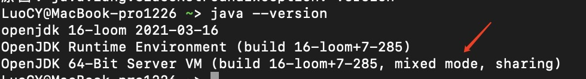

### jvm error日志


JVM莫名其妙执行一段时间后，就崩溃的问题，通过上面的日志，信息有：

CompilationPolicy::can_be_compiled

文件在./hotspot/src/share/vm/runtime/compilationPolicy.cpp找到对应的方法：can_be_compiled
```
bool CompilationPolicy::can_be_compiled(methodHandle m, int comp_level) {
  // allow any levels for WhiteBox
  assert(WhiteBoxAPI || comp_level == CompLevel_all || is_compile(comp_level), "illegal compilation level");
 
  if (m->is_abstract()) return false;
  
  //如果方法的字节码长度超过HugeMethodLimit，不适用JIT编译
  if (DontCompileHugeMethods && m->code_size() > HugeMethodLimit) return false;
  ....
}
```

DontCompileHugeMethods & HugeMethodLimit 的定义在./hotspot/src/share/vm/runtime/globals.hpp
```
 product(bool, DontCompileHugeMethods, true,                               
          "don't compile methods > HugeMethodLimit") 
 
develop(intx, HugeMethodLimit,  8000,                                     
          "don't compile methods larger than this if "                      
          "+DontCompileHugeMethods")  

```
从上面的定义可知，如果方法的字节码长度超过8000byte(差不多2500行) & DontCompileHugeMethods =true，不会执行jit编译，这也是不建议写大方法的原因之一。

如果想改变这个条件，即增加VM参数”-XX:-DontCompileHugeMethods”来强迫JVM编译大方法。

但是不建议这么做，因为一旦Code Cache满了，HotSpot会停止所有后续的编译任务，虽然已编译的代码不受影响，但是后面的所有方法都会强制停留在纯解释模式。

### C1 C2 
日志里出现这C2个关键字，需要联想到jit( just in time)，也就是即时编译编译器。

这里涉及到的知识点是JIT编译器在运行时的两种模式：JVM Server 模式与 client 模式，以及分层编译的策略。

程序为了达到启动速度和执行效率的平衡，虚拟机采用分层编译的策略，包括：

第0层：解释执行，解释器不开性能监控；

第1层：C1编译，将字节码编译成本地代码，进行简单、可靠的优化，使用的是一个代号为 C1 的轻量级编译器，虚拟机运行参数里有-client；

第2层：C2编译，也是将字节码编译为本地代码，启动时，速度较慢，但是一旦运行起来后，性能将会有很大的提升。由于采用相对重量级代号为 C2 的编译器，C2 比 C1 编译器编译的相对彻底，服务起来之后，性能更高。

实施分层编译后，Client Compiler和Server Compiler 将会同时工作，许多代码都可能会多次编译，C1获取更高的编译速度，用C2获取更好的编译质量，在解释时候的时候也无须再承担收集性能监控信息的任务。

通过java -version查看JIT编译的模式



mixed mode是混合模式，使用-Xint -Xcomp改变执行方式解释模式、编译模式。所谓解释模式，即不使用jit,直接由解释器执行所有字节码，执行效率不高；编译模式即将所有的字节码无论执行频率都编译为机器码，完全没有必要，所以采用混合模式（默认）即可。

### JIT原理
JVM读取.class文件之后，会交给JIT，其根据是否是热点代码判断可否将该方法优化成机器码。


如何判断一个方法是否为热点呢？

**基于采样的热点探测**：周期性地检查各个线程的栈顶，如果发现某些方法经常出现在栈顶，那这段方法代码就是“热点代码”。

**基于计数器的热点探测**：为方法或代码块建立计数器，统计执行次数，执行次数超过一个阈值，认定为热点代码。该策略是JVM默认采用的，计数器可以分为方法调用计数器 & 回边计数器，当 JVM 执行一个 Java 方法，它会检查这两个计数器的总和以决定这个方法是否有资格被编译。

**方法调用计数器**：一段时间内方法被调用的次数。超过一定时间，如果方法被调用次数减少，不足以提交到编译优化，则热度衰减。可用-XX:-UseCounterDecay来关闭热度衰减，可用-XX:-UseCounterDecay来关闭热度衰减。其中阈值Client=1500，Server=10000。

**回边计数器**：统计一个方法中的for或者while的运行次数, 全部循环结束或者continue都算做完整的循环回边。当超过一个阈值时，会触发JIT。通过命令可以查看

```
java -XX:+PrintFlagsFinal -version | grep CompileThreshold
    （T1）  intx CompileThreshold   = 10000     （简单C1编译代码，不做性能分析）                      
         uintx IncreaseFirstTierCompileThresholdA  = 50                                 
     (T2） intx Tier2CompileThreshold =0       （受限的C1编译代码,不做性能分析，根据方法调用次数和方法内部循环次数来启动）                         
     (T3) intx Tier3CompileThreshold = 2000    （完全C1编译代码,编译器收集分析信息之后做的编译）                            
     (T4) intx Tier4CompileThreshold  = 15000  （C2编译代码,编译最慢,编译后执行速度最快）                            
```
T2的作用是当C2编译器队列满（或者太长）时，从server队列中取出方法，以级别2进行编译，直到C2能接着处理性能分析。

#### Client模式：    

方法调用计数器阈值（CompileThreshold）* OSR比率（OnStackReplacePercentage）/100。其中OnStackReplacePercentage默认值为933，如果都取默认值，那Client模式虚拟机回边数的阈值为13995。

#### Server模式：

方法调用计数器阈值（CompileThreshold）*（OSR比率（OnStackReplacePercentage）减去解释器监控比率（InterpreterProfilePercentage）的差值）/100。

其中OnStackReplacePercentage默认值为140，InterpreterProfilePercentage默认值为33，如果都取默认值，那Server模式虚拟机回边计数器的阈值为10700。

JIT在编译字节码的时候，需要一个缓存来存放汇编指令，通过参数–XX:ReservedCodeCacheSize设置，如果该值较小到不足以支持指令的存放，会造成JVM 则不能再编译更多的代码，JVM将使用大量的解释代码拖慢运行速度。

### JIT导致Load偏高

#### load偏高的原因可能有

长时间执行耗费CPU的操作，例如循环代码（usr使用率较高）；

等待资源竞争（锁、IO），导致处理请求速度变慢（sys占比高）；

频繁切换线程上下文（sys占比高）；

短时间大量流量进入；

#### 排查方式
```
1、重启服务应用

2、top -H 查看最耗费CPU的线程，printf "%x" PID 转换成十六进制PID

3、jstack pid | grep 十六进程pid 查看这个线程在干嘛
```
JVM在启动初期解释字节码进行执行,当方法执行次数达到指定阈值后，触发JIT把字节码编译成机器码，这个过程消耗CPU资源比较严重。这个时候load会上升，处理请求的速度变慢，导致线程池满。通常JIT在工作时，在jstack中能看到C2 CompilerThread

$fgrep 33644 jstack.pid210477.2020 -A 2
"C2 CompilerThread1" daemon prio=10 tid=0x00007f4cbc146800 nid=0x33644 runnable [0x0000000000000000]
   java.lang.Thread.State: RUNNABLE
   
### 解决方案
1、手动添加预热代码

将触发JIT的阈值=1，编写WarmUpContextListener实现Spring的ApplicationContextAware接口，在服务启动之前Spring调用WarmUpContextListener.invoke方法中指定需要预热的方法。但不好之处在于应用启动时间拉长。

2、开启-XX:+TieredCompilation & 加大-XX:ReservedCodeCacheSize

使用-XX:+TieredCompilation时要注意JDK的版本，在JDK7 中，不要使用-XX:+TieredCompilation来缓解应用重启JIT编译导致的cpu 100%的问题。在JDK8中，ReservedCodeCacheSize=240M，默认开启了TieredCompilation。


请注意：Code Cache是不会被回收的，累计到240M之后，JIT就无法继续编译优化，回归到解释执行。建议启用-XX:+UseCodeCacheFlushing开启Code Cache回收机制。

### 参考
[j-lo-just-in-time](https://www.ibm.com/developerworks/cn/java/j-lo-just-in-time/index.html)

[the-way-of-jit-optimization](https://zhuxingsheng.github.io/2017/04/05/the-way-of-jit-optimization/)
