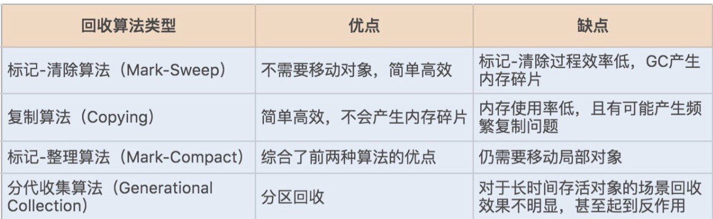
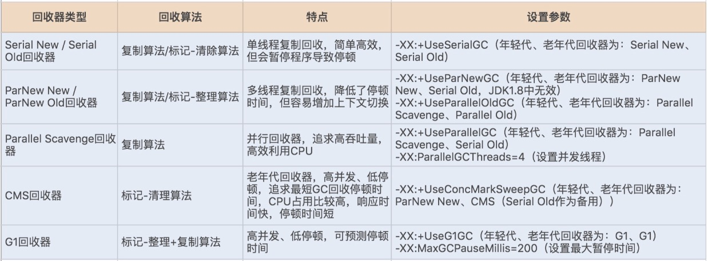
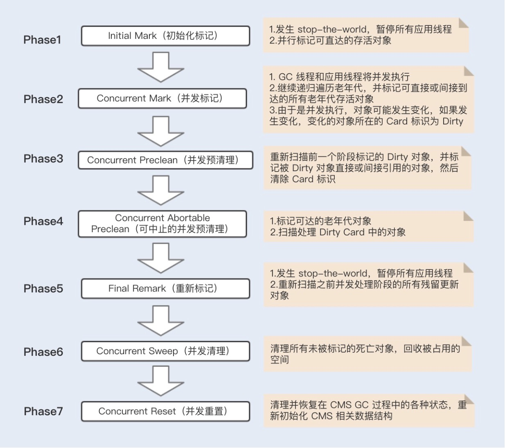
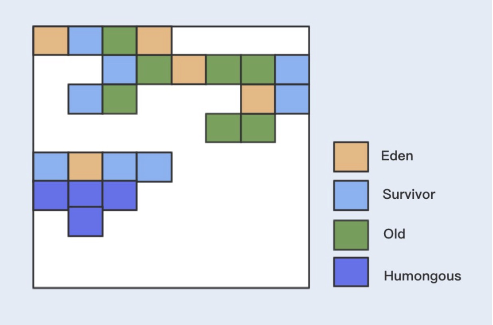
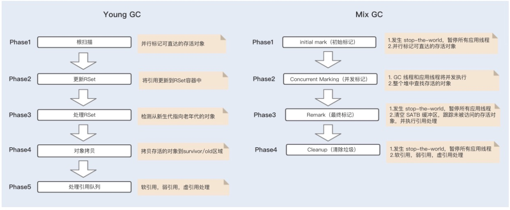

### 垃圾回收机制

#### 回收发生在哪里

JVM 的内存区域中，程序计数器、虚拟机栈和本地方法栈这 3 个区域是线程私有的，随着线程的创建而创建，销毁而销毁；栈中的栈帧随着方法的进入和退出进行入栈和出栈操作，每个栈帧中分配多少内存基本是在类结构确定下来的时候就已知的，因此这三个区域的内存分配和回收都具有确定性。

那么垃圾回收的重点就是关注堆和方法区中的内存了，堆中的回收主要是对象的回收，方法区的回收主要是废弃常量和无用的类的回收。

#### 对象在什么时候可以被回收

引用计数算法：这种算法是通过一个对象的引用计数器来判断该对象是否被引用了。每当对象被引用，引用计数器就会加 1；每当引用失效，计数器就会减 1。当对象的引用计数器的值为 0 时，就说明该对象不再被引用，可以被回收了。这里强调一点，虽然引用计数算法的实现简单，判断效率也很高，但它存在着对象之间相互循环引用的问题。

可达性分析算法：GC Roots 是该算法的基础，GC Roots 是所有对象的根对象，在 JVM加载时，会创建一些普通对象引用正常对象。这些对象作为正常对象的起始点，在垃圾回收时，会从这些 GC Roots 开始向下搜索，当一个对象到 GC Roots 没有任何引用链相连时，就证明此对象是不可用的。目前 HotSpot 虚拟机采用的就是这种算法。

以上两种算法都是通过引用来判断对象是否可以被回收。在 JDK 1.2 之后，Java 对引用的概念进行了扩充，将引用分为了以下四种：
```text
引用类型                                功能特点
强引用(Strong reference)           该类引用的对象永远不会被GC回收
软引用(soft reference)             该类引用的对象在jvm内存不足的情况下GC才会去回收该类引用的对象
弱引用(weak reference)             该类引用的对象在被GC扫描到就会进行回收
虚引用(phantom reference)          该类引用的对象的作用就是对象在回收时可以获取到一个通知到引用队列，用于监控对象生命周期
```

#### 如何回收这些对象

自动性：Java 提供了一个系统级的线程来跟踪每一块分配出去的内存空间，当 JVM 处于空闲循环时，垃圾收集器线程会自动检查每一块分配出去的内存空间，然后自动回收每一块空闲的内存块。

不可预期性：一旦一个对象没有被引用了，该对象是否立刻被回收呢？答案是不可预期的。很难确定一个没有被引用的对象是不是会被立刻回收掉，因为有可能当程序结束后，这个对象仍在内存中。

垃圾回收线程在 JVM 中是自动执行的，Java 程序无法强制执行。唯一能做的就是通过调用 System.gc 方法来"建议"执行垃圾收集器，具体是否执行决定权在JVM。

### Java GC 

#### GC 算法


#### GC 收集器


可以通过 JVM 工具查询当前 JVM 使用的垃圾收集器类型，首先通过 ps 命令查询出经常 ID，再通过 jmap -heap ID 查询出 JVM 的配置信息，其中就包括垃圾收集器的设置类型。

jdk11后查询条件: jhsdb jmap --heap --pid pid-number

jstat -gc pid interval 查看每次 GC 之后，具体每一个分区的内存使用率变化情况，可以通过 JVM 的设置参数，来查看垃圾收集器的具体设置参数，使用的方式有很多，例如 jcmd pid VM.flags 就可以查看到相关的设置参数。

#### GC 性能衡量指标

吞吐量：这里的吞吐量是指应用程序所花费的时间和系统总运行时间的比值。我们可以按照这个公式来计算 GC 的吞吐量：系统总运行时间 = 应用程序耗时 +GC 耗时。如果系统运行了 100 分钟，GC 耗时 1 分钟，则系统吞吐量为 99%。GC 的吞吐量一般不能低于95%。

停顿时间：指垃圾收集器正在运行时，应用程序的暂停时间。对于串行回收器而言，停顿时间可能会比较长；而使用并发回收器，由于垃圾收集器和应用程序交替运行，程序的停顿时间就会变短，但其效率很可能不如独占垃圾收集器，系统的吞吐量也很可能会降低。

垃圾回收频率：多久发生一次指垃圾回收呢？通常垃圾回收的频率越低越好，增大堆内存空间可以有效降低垃圾回收发生的频率，但同时也意味着堆积的回收对象越多，最终也会增加回收时的停顿时间。所以我们只要适当地增大堆内存空间，保证正常的垃圾回收频率即可。

#### 查看 & 分析 GC 日志

需要通过 JVM 参数预先设置 GC 日志，通常有以下几种 JVM 参数设置：
```text
-XX:+PrintGC 输出 GC 日志
-XX:+PrintGCDetails 输出 GC 的详细日志
-XX:+PrintGCTimeStamps 输出 GC 的时间戳（以基准时间的形式）
-XX:+PrintGCDateStamps 输出 GC 的时间戳（以日期的形式，如 2013-05-04T21:53:59.234+0800）
-XX:+PrintHeapAtGC 在进行 GC 的前后打印出堆的信息
-Xloggc:../logs/gc.log 日志文件的输出路径
```

运行很短时间的 GC 日志，如果是长时间的 GC 日志，很难通过文本形式去查看整体的 GC 性能。此时，可以通过离线 [GCView](https://sourceforge.net/projects/gcviewer/) 或者在线 [gceasy](https://www.gceasy.io/index.jsp) 工具打开日志文件，图形化界面查看整体的 GC 性能。

#### GC 调优策略

##### 降低 Minor GC 频率

由于新生代空间较小，Eden 区很快被填满，就会导致频繁 Minor GC，因此可以通过增大新生代空间来降低 Minor GC 的频率。

扩容 Eden 区虽然可以减少 Minor GC 的次数，但会增加单次Minor GC 的时间，那也很难达到期待的优化效果？
```text
单次 Minor GC 时间是由两部分组成：T1（扫描新生代）和 T2（复制存活对象）。

假设一个对象在 Eden 区的存活时间为 500ms，Minor GC 的时间间隔是 300ms，那么正常情况下，Minor GC 的时间为 ：T1+T2。

当我们增大新生代空间，Minor GC 的时间间隔可能会扩大到 600ms，此时一个存活500ms 的对象就会在 Eden 区中被回收掉，此时就不存在复制存活对象了，所以再发生Minor GC 的时间为：两次扫描新生代，即 2T1。

可见，扩容后，Minor GC 时增加了 T1，但省去了 T2 的时间。通常在虚拟机中，复制对象的成本要远高于扫描成本。

如果在堆内存中存在较多的长期存活的对象，此时增加年轻代空间，反而会增加 Minor GC的时间。如果堆中的短期对象很多，那么扩容新生代，单次 Minor GC 时间不会显著增加。因此，单次 Minor GC 时间更多取决于 GC 后存活对象的数量，而非 Eden 区的大小。
```

##### 降低 Full GC 的频率

通常情况下，由于堆内存空间不足或老年代对象太多，会触发 Full GC，频繁的 Full GC 会带来上下文切换，增加系统的性能开销。可以使用哪些方法来降低 Full GC 的频率呢？

减少创建大对象：在平常的业务场景中，我们习惯一次性从数据库中查询出一个大对象用于web 端显示。例如，我之前碰到过一个一次性查询出 60 个字段的业务操作，这种大对象如果超过年轻代最大对象阈值，会被直接创建在老年代；即使被创建在了年轻代，由于年轻代的内存空间有限，通过 Minor GC 之后也会进入到老年代。这种大对象很容易产生较多的 Full GC。

增大堆内存空间：在堆内存不足的情况下，增大堆内存空间，且设置初始化堆内存为最大堆内存，也可以降低 Full GC 的频率。

#### 选择合适的 GC 回收器

要求每次操作的响应时间必须在 500ms 以内。这个时候我们一般会选择响应速度较快的 GC 回收器，CMS（Concurrent Mark Sweep）回收器和 G1 回收器都是不错的选择。

而当我们的需求对系统吞吐量有要求时，就可以选择 Parallel Scavenge 回收器来提高系统的吞吐量。

#### 总结

垃圾收集器的种类很多，我们可以将其分成两种类型，一种是响应速度快，一种是吞吐量高。通常情况下，CMS 和 G1 回收器的响应速度快，Parallel Scavenge 回收器的吞吐量高。

在 JDK1.8 环境下，默认使用的是 Parallel Scavenge（年轻代）+Serial Old（老年代）垃圾收集器，可以通过查询 JVM 的 GC 默认配置方法进行查看。

通常情况，JVM 是默认垃圾回收优化的，在没有性能衡量标准的前提下，尽量避免修改GC 的一些性能配置参数。如果一定要改，那就必须基于大量的测试结果或线上的具体性能来进行调整。

### CMS 垃圾收集器

CMS 垃圾收集器是基于标记清除算法实现的，目前主要用于老年代垃圾回收。CMS 收集器的 GC 周期主要由 7 个阶段组成，其中有两个阶段会发生 stop-the-world，其它阶段都是并发执行的。



### C1 垃圾收集器

G1 垃圾收集器是基于标记整理算法实现的，是一个分代垃圾收集器，既负责年轻代，也负责老年代的垃圾回收。

跟之前各个分代使用连续的虚拟内存地址不一样，G1 使用了一种 Region 方式对堆内存进行了划分，同样也分年轻代、老年代，但每一代使用的是 N 个不连续的 Region 内存块，每个 Region 占用一块连续的虚拟内存地址。

在 G1 中，还有一种叫 Humongous 区域，用于存储特别大的对象，G1 内部做了一个优化，一旦发现没有引用指向巨型对象，则可直接在年轻代的 YoungGC 中被回收掉。



G1 分为 Young GC、Mix GC 以及 Full GC。

G1 Young GC 主要是在 Eden 区进行，当 Eden 区空间不足时，则会触发一次 YoungGC，将 Eden 区数据移到 Survivor 空间时，如果 Survivor 空间不足，则会直接晋升到老年代，此时 Survivor 的数据也会晋升到老年代，Young GC 的执行是并行的，期间会发生STW。

当堆空间的占用率达到一定阈值后会触发 G1 Mix GC（阈值由命令参数 -XX:InitiatingHeapOccupancyPercent 设定，默认值 45），Mix GC 主要包括了四个阶段，其中只有并发标记阶段不会发生 STW，其它阶段均会发生 STW。



### G1 和 CMS 主要的区别

CMS 主要集中在老年代的回收，而 G1 集中在分代回收，包括了年轻代的 Young GC 以及老年代的 Mix GC；

G1 使用了 Region 方式对堆内存进行了划分，且基于标记整理算法实现，整体减少了垃圾碎片的产生；

在初始化标记阶段，搜索可达对象使用到的 Card Table，其实现方式不一样。

CMS 和 G1 在解决并发标记时漏标的方式也不一样，CMS 使用的是Incremental Update 算法，而 G1 使用的是 SATB 算法。

#### Card Table

Card Table，在垃圾回收的时候都是从 Root 开始搜索，这会先经过年轻代再到老年代，也有可能老年代引用到年轻代对象，如果发生 Young GC，除了从年轻代扫描根对象之外，还需要再从老年代扫描根对象，确认引用年轻代对象的情况。

这种属于跨代处理，非常消耗性能，为了避免在回收年轻代时跨代扫描整个老年代，CMS和 G1 都用到了 Card Table 来记录这些引用关系，只是 G1 在 Card Table 的基础上引入了 RSet，每个 Region 初始化时，都会初始化一个 RSet，RSet 记录了其它 Region 中的对象引用本 Region 对象的关系。

#### 并发标记

G1 和 CMS 都是基于三色标记算法来实现的：
```text
黑色：根对象，或者对象和对象中的子对象都被扫描
灰色：对象本身被扫描，但还没扫描对象中的子对象
白色：不可达对象
```

基于这种标记有一个漏标的问题，也就是说，当一个白色标记对象，在垃圾回收被清理掉时，正好有一个对象引用了该白色标记对象，此时由于被回收掉了，就会出现对象丢失的问题。

为了避免上述问题，CMS 采用了 Incremental Update 算法，只要在写屏障（write barrier）里发现一个白对象的引用被赋值到一个黑对象的字段里，那就把这个白对象变成灰色的，而在 G1 中，采用的是 SATB 算法，该算法认为开始时所有能遍历到的对象都是需要标记的，即认为都是活的。

G1 具备 Pause Prediction Model ，即停顿预测模型。用户可以设定整个 GC 过程中期望的停顿时间，用参数 -XX:MaxGCPauseMillis 可以指定一个 G1 收集过程的目标停顿时间，默认值 200ms。

G1 会根据这个模型统计出来的历史数据，来预测一次垃圾回收所需要的 Region 数量，通过控制 Region 数来控制目标停顿时间的实现。

### Minor GC 与 Major GC

不管什么 GC，都会发送 stop-the-world，区别是发生的时间长短。而这个时间跟垃圾收集器又有关系，Serial、PartNew、Parallel Scavenge 收集器无论是串行还是并行，都会挂起用户线程，而 CMS 和 G1 在并发标记时，是不会挂起用户线程的，但其它时候一样会挂起用户线程，stop the world 的时间相对来说就小很多了。

Major Gc 在很多参考资料中是等价于 Full GC 的，也可以发现很多性能监测工具中只有 Minor GC 和 Full GC，一般情况下，一次 Full GC 将会对年轻代、老年代、元空间以及堆外内存进行垃圾回收。

触发 Full GC 的原因有很多：
```text
当年轻代晋升到老年代的对象大小，并比目前老年代剩余的空间大小还要大时，会触发Full GC；
当老年代的空间使用率超过某阈值时，会触发 Full GC；
当元空间不足时（JDK1.7 永久代不足），也会触发 Full GC；
当调用 System.gc() 也会安排一次 Full GC。
```


