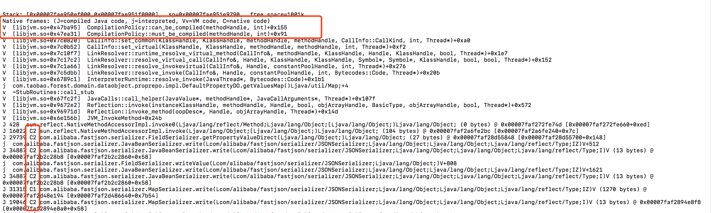
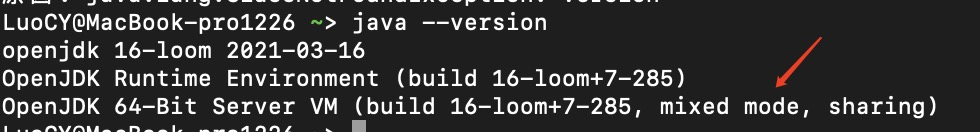
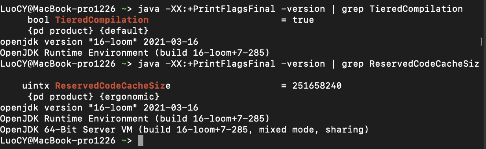

### jvm error日志


JVM莫名其妙执行一段时间后，就崩溃的问题，通过上面的日志，信息有：

CompilationPolicy::can_be_compiled

文件在./hotspot/src/share/vm/runtime/compilationPolicy.cpp找到对应的方法：can_be_compiled
```
bool CompilationPolicy::can_be_compiled(methodHandle m, int comp_level) {
  // allow any levels for WhiteBox
  assert(WhiteBoxAPI || comp_level == CompLevel_all || is_compile(comp_level), "illegal compilation level");
 
  if (m->is_abstract()) return false;
  
  //如果方法的字节码长度超过HugeMethodLimit，不适用JIT编译
  if (DontCompileHugeMethods && m->code_size() > HugeMethodLimit) return false;
  ....
}
```

DontCompileHugeMethods & HugeMethodLimit 的定义在./hotspot/src/share/vm/runtime/globals.hpp
```
 product(bool, DontCompileHugeMethods, true,                               
          "don't compile methods > HugeMethodLimit") 
 
develop(intx, HugeMethodLimit,  8000,                                     
          "don't compile methods larger than this if "                      
          "+DontCompileHugeMethods")  

```
从上面的定义可知，如果方法的字节码长度超过8000byte(差不多2500行) & DontCompileHugeMethods =true，不会执行jit编译，这也是不建议写大方法的原因之一。

如果想改变这个条件，即增加VM参数”-XX:-DontCompileHugeMethods”来强迫JVM编译大方法。

但是不建议这么做，因为一旦Code Cache满了，HotSpot会停止所有后续的编译任务，虽然已编译的代码不受影响，但是后面的所有方法都会强制停留在纯解释模式。

### C1 C2 
日志里出现这C2个关键字，需要联想到jit( just in time)，也就是即时编译编译器。

这里涉及到的知识点是JIT编译器在运行时的两种模式：JVM Server 模式与 client 模式，以及分层编译的策略。

程序为了达到启动速度和执行效率的平衡，虚拟机采用分层编译的策略，包括：

第0层：解释执行，解释器不开性能监控；

第1层：C1编译，将字节码编译成本地代码，进行简单、可靠的优化，使用的是一个代号为 C1 的轻量级编译器，虚拟机运行参数里有-client；

第2层：C2编译，也是将字节码编译为本地代码，启动时，速度较慢，但是一旦运行起来后，性能将会有很大的提升。由于采用相对重量级代号为 C2 的编译器，C2 比 C1 编译器编译的相对彻底，服务起来之后，性能更高。

实施分层编译后，Client Compiler和Server Compiler 将会同时工作，许多代码都可能会多次编译，C1获取更高的编译速度，用C2获取更好的编译质量，在解释时候的时候也无须再承担收集性能监控信息的任务。

通过java -version查看JIT编译的模式



mixed mode是混合模式，使用-Xint -Xcomp改变执行方式解释模式、编译模式。所谓解释模式，即不使用jit,直接由解释器执行所有字节码，执行效率不高；编译模式即将所有的字节码无论执行频率都编译为机器码，完全没有必要，所以采用混合模式（默认）即可。

### JIT原理
JVM读取.class文件之后，会交给JIT，其根据是否是热点代码判断可否将该方法优化成机器码。


如何判断一个方法是否为热点呢？

**基于采样的热点探测**：周期性地检查各个线程的栈顶，如果发现某些方法经常出现在栈顶，那这段方法代码就是“热点代码”。

**基于计数器的热点探测**：为方法或代码块建立计数器，统计执行次数，执行次数超过一个阈值，认定为热点代码。该策略是JVM默认采用的，计数器可以分为方法调用计数器 & 回边计数器，当 JVM 执行一个 Java 方法，它会检查这两个计数器的总和以决定这个方法是否有资格被编译。

**方法调用计数器**：一段时间内方法被调用的次数。超过一定时间，如果方法被调用次数减少，不足以提交到编译优化，则热度衰减。可用-XX:-UseCounterDecay来关闭热度衰减，可用-XX:-UseCounterDecay来关闭热度衰减。其中阈值Client=1500，Server=10000。

**回边计数器**：统计一个方法中的for或者while的运行次数, 全部循环结束或者continue都算做完整的循环回边。当超过一个阈值时，会触发JIT。通过命令可以查看

```
java -XX:+PrintFlagsFinal -version | grep CompileThreshold
    （T1）  intx CompileThreshold   = 10000     （简单C1编译代码，不做性能分析）                      
         uintx IncreaseFirstTierCompileThresholdA  = 50                                 
     (T2） intx Tier2CompileThreshold =0       （受限的C1编译代码,不做性能分析，根据方法调用次数和方法内部循环次数来启动）                         
     (T3) intx Tier3CompileThreshold = 2000    （完全C1编译代码,编译器收集分析信息之后做的编译）                            
     (T4) intx Tier4CompileThreshold  = 15000  （C2编译代码,编译最慢,编译后执行速度最快）                            
```
T2的作用是当C2编译器队列满（或者太长）时，从server队列中取出方法，以级别2进行编译，直到C2能接着处理性能分析。

#### Client模式：    

方法调用计数器阈值（CompileThreshold）* OSR比率（OnStackReplacePercentage）/100。其中OnStackReplacePercentage默认值为933，如果都取默认值，那Client模式虚拟机回边数的阈值为13995。

#### Server模式：

方法调用计数器阈值（CompileThreshold）*（OSR比率（OnStackReplacePercentage）减去解释器监控比率（InterpreterProfilePercentage）的差值）/100。

其中OnStackReplacePercentage默认值为140，InterpreterProfilePercentage默认值为33，如果都取默认值，那Server模式虚拟机回边计数器的阈值为10700。

JIT在编译字节码的时候，需要一个缓存来存放汇编指令，通过参数–XX:ReservedCodeCacheSize设置，如果该值较小到不足以支持指令的存放，会造成JVM 则不能再编译更多的代码，JVM将使用大量的解释代码拖慢运行速度。

### JIT导致Load偏高

#### load偏高的原因可能有

长时间执行耗费CPU的操作，例如循环代码（usr使用率较高）；

等待资源竞争（锁、IO），导致处理请求速度变慢（sys占比高）；

频繁切换线程上下文（sys占比高）；

短时间大量流量进入；

#### 排查方式
```
1、重启服务应用

2、top -H 查看最耗费CPU的线程，printf "%x" PID 转换成十六进制PID

3、jstack pid | grep 十六进程thid 查看这个线程在干嘛
```
JVM在启动初期解释字节码进行执行,当方法执行次数达到指定阈值后，触发JIT把字节码编译成机器码，这个过程消耗CPU资源比较严重。这个时候load会上升，处理请求的速度变慢，导致线程池满。通常JIT在工作时，在jstack中能看到C2 CompilerThread

$fgrep 33644 jstack.pid210477.2020 -A 2
"C2 CompilerThread1" daemon prio=10 tid=0x00007f4cbc146800 nid=0x33644 runnable [0x0000000000000000]
   java.lang.Thread.State: RUNNABLE
   
### 解决方案
1、手动添加预热代码

将触发JIT的阈值=1，编写WarmUpContextListener实现Spring的ApplicationContextAware接口，在服务启动之前Spring调用WarmUpContextListener.invoke方法中指定需要预热的方法。但不好之处在于应用启动时间拉长。

2、开启-XX:+TieredCompilation & 加大-XX:ReservedCodeCacheSize

使用-XX:+TieredCompilation时要注意JDK的版本，在JDK7 中，不要使用-XX:+TieredCompilation来缓解应用重启JIT编译导致的cpu 100%的问题。在JDK8中，ReservedCodeCacheSize=240M，默认开启了TieredCompilation。



请注意：Code Cache是不会被回收的，累计到240M之后，JIT就无法继续编译优化，回归到解释执行。建议启用-XX:+UseCodeCacheFlushing开启Code Cache回收机制。

### 参考
[j-lo-just-in-time](https://www.ibm.com/developerworks/cn/java/j-lo-just-in-time/index.html)

[the-way-of-jit-optimization](http://www.zhuxingsheng.com/blog/jit-optimization.html)

### 即时编译器类型

在 HotSpot 虚拟机中，内置了两个 JIT，分别为 C1 编译器和 C2 编译器，这两个编译器的编译过程是不一样的。

C1 编译器是一个简单快速的编译器，主要的关注点在于局部性的优化，适用于执行时间较短或对启动性能有要求的程序，例如，GUI 应用对界面启动速度就有一定要求。

C2 编译器是为长期运行的服务器端应用程序做性能调优的编译器，适用于执行时间较长或对峰值性能有要求的程序。根据各自的适配性，这两种即时编译也被称为 Client Compiler和 Server Compiler。

在 Java7 之前，需要根据程序的特性来选择对应的 JIT，虚拟机默认采用解释器和其中一个编译器配合工作。

Java7 引入了分层编译，这种方式综合了 C1 的启动性能优势和 C2 的峰值性能优势，我们也可以通过参数 “-client”“-server” 强制指定虚拟机的即时编译模式，分层编译将JVM 的执行状态分为了 5 个层次：

第 0 层：程序解释执行，默认开启性能监控功能（Profiling），如果不开启，可触发第二层编译；

第 1 层：可称为 C1 编译，将字节码编译为本地代码，进行简单、可靠的优化，不开启Profiling；

第 2 层：也称为 C1 编译，开启 Profiling，仅执行带方法调用次数和循环回边执行次数profiling 的 C1 编译；

第 3 层：也称为 C1 编译，执行所有带 Profiling 的 C1 编译；

第 4 层：可称为 C2 编译，也是将字节码编译为本地代码，但是会启用一些编译耗时较长的优化，甚至会根据性能监控信息进行一些不可靠的激进优化。

在 Java8 中，默认开启分层编译，-client 和 -server 的设置已经是无效的了。如果只想开启 C2，可以关闭分层编译（-XX:-TieredCompilation），如果只想用 C1，可以在打开分层编译的同时，使用参数：-XX:TieredStopAtLevel=1。

除了这种默认的混合编译模式，我们还可以使用“-Xint”参数强制虚拟机运行于只有解释器的编译模式下，这时 JIT 完全不介入工作；我们还可以使用参数“-Xcomp”强制虚拟机运行于只有 JIT 的编译模式下。

通过 java -version 命令行可以直接查看到当前系统使用的编译模式：
```
$ java -version
java version "1.8.0_211"
Java(TM) SE Runtime Environment (build 1.8.0_211-b12)
Java HotSpot(TM) 64-Bit Server VM (build 25.211-b12, mixed mode)

$ java -Xint -version
java version "1.8.0_211"
Java(TM) SE Runtime Environment (build 1.8.0_211-b12)
Java HotSpot(TM) 64-Bit Server VM (build 25.211-b12, interpreted mode)

$ java -Xcomp -version 
java version "1.8.0_211"
Java(TM) SE Runtime Environment (build 1.8.0_211-b12)
Java HotSpot(TM) 64-Bit Server VM (build 25.211-b12, compiled mode) 
```

### 热点探测在

在HotSpot 虚拟机中的热点探测是 JIT 优化的条件，热点探测是基于计数器的热点探测，采用这种方法的虚拟机会为每个方法建立计数器统计方法的执行次数，如果执行次数超过一定的阈值就认为它是“热点方法” 。

虚拟机为每个方法准备了两类计数器：方法调用计数器（Invocation Counter）和回边计数器（Back Edge Counter）。在确定虚拟机运行参数的前提下，这两个计数器都有一个确定的阈值，当计数器超过阈值溢出了，就会触发 JIT 编译。

#### 方法调用计数器

用于统计方法被调用的次数，方法调用计数器的默认阈值在 C1 模式下是1500 次，在 C2 模式在是 10000 次，可通过 -XX: CompileThreshold 来设定；而在分层编译的情况下，-XX: CompileThreshold 指定的阈值将失效，此时将会根据当前待编译的方法数以及编译线程数来动态调整。当方法计数器和回边计数器之和超过方法计数器阈值时，就会触发 JIT 编译器。 

#### 回边计数器

用于统计一个方法中循环体代码执行的次数，在字节码中遇到控制流向后跳转的指令称为“回边”（Back Edge），该值用于计算是否触发 C1 编译的阈值，在不开启分层编译的情况下，C1 默认为 13995，C2 默认为 10700，可通过 -XX:OnStackReplacePercentage=N 来设置；而在分层编译的情况下，-XX:OnStackReplacePercentage 指定的阈值同样会失效，此时将根据当前待编译的方法数以及编译线程数来动态调整。

建立回边计数器的主要目的是为了触发 OSR（On StackReplacement）编译，即栈上编译。在一些循环周期比较长的代码段中，当循环达到回边计数器阈值时，JVM 会认为这段是热点代码，JIT 编译器就会将这段代码编译成机器语言并缓存，在该循环时间段内，会直接将执行代码替换，执行缓存的机器语言。

### 编译优化技术

#### 方法内联

调用一个方法通常要经历压栈和出栈，调用方法是将程序执行顺序转移到存储该方法的内存地址，将方法的内容执行完后，再返回到执行该方法前的位置，这种执行操作要求在执行前保护现场并记忆执行的地址，执行后要恢复现场，并按原来保存的地址继续执行。 因此，方法调用会产生一定的时间和空间方面的开销。

那么对于那些方法体代码不是很大，又频繁调用的方法来说，这个时间和空间的消耗会很大。方法内联的优化行为就是把目标方法的代码复制到发起调用的方法之中，避免发生真实的方法调用。

那么对于那些方法体代码不是很大，又频繁调用的方法来说，这个时间和空间的消耗会很大。方法内联的优化行为就是把目标方法的代码复制到发起调用的方法之中，避免发生真实的方法调用。

如下:
```
优化前：
private int add1(int x1, int x2, int x3, int x4) {    
    return add2(x1, x2) + add2(x3, x4);
}

private int add2(int x1, int x2) {    
    return x1 + x2;
}

优化后：
private int add1(int x1, int x2, int x3, int x4){
    retuen x1 + x2 + x3 + x4;
}
```

JVM 会自动识别热点方法，并对它们使用方法内联进行优化。可以通过 -XX:CompileThreshold 来设置热点方法的阈值。但要强调一点，热点方法不一定会被 JVM做内联优化，如果这个方法体太大了，JVM 将不执行内联操作。而方法体的大小阈值，也可以通过参数设置来优化：

```
经常执行的方法，默认情况下，方法体大小小于 325 字节的都会进行内联，我们可以通过 -XX:MaxFreqInlineSize=N 来设置大小值；

不是经常执行的方法，默认情况下，方法大小小于 35 字节才会进行内联，我们也可以通过 -XX:MaxInlineSize=N 来重置大小值。
```

可以通过配置 JVM 参数来查看到方法被内联的情况：
```
-XX:+PrintCompilation // 在控制台打印编译过程信息
-XX:+UnlockDiagnosticVMOptions // 解锁对 JVM 进行诊断的选项参数。默认是关闭的，开启后支持一些
-XX:+PrintInlining // 将内联方法打印出来
```

热点方法的优化可以有效提高系统性能，一般我们可以通过以下几种方式来提高方法内联：

通过设置 JVM 参数来减小热点阈值或增加方法体阈值，以便更多的方法可以进行内联，但这种方法意味着需要占用更多地内存；

在编程中，避免在一个方法中写大量代码，习惯使用小方法体；

尽量使用 final、private、static 关键字修饰方法，编码方法因为继承，会需要额外的类型检查。

### 逃逸分析

逃逸分析（Escape Analysis）是判断一个对象是否被外部方法引用或外部线程访问的分析技术，编译器会根据逃逸分析的结果对代码进行优化。

#### 栈上分配

在 Java 中默认创建一个对象是在堆中分配内存的，而当堆内存中的对象不再使用时，则需要通过垃圾回收机制回收，这个过程相对分配在栈中的对象的创建和销毁来说，更消耗时间和性能。这个时候，逃逸分析如果发现一个对象只在方法中使用，就会将对象分配在栈上。

由于 HotSpot 虚拟机目前的实现导致栈上分配实现比较复杂，可以说，在HotSpot 中暂时没有实现这项优化。随着即时编译器的发展与逃逸分析技术的逐渐成熟，相信不久的将来 HotSpot 也会实现这项优化功能。

#### 锁消除

在非线程安全的情况下，尽量不要使用线程安全容器，比如 StringBuffer。由于StringBuffer 中的 append 方法被 Synchronized 关键字修饰，会使用到锁，从而导致性能下降。

但实际上，在单线程中，StringBuffer 和 StringBuilder 的性能基本没什么区别。这是因为在局部方法中创建的对象只能被当前线程访问，无法被其它线程访问，这个变量的读写肯定不会有竞争，这个时候 JIT 编译会对这个对象的方法锁进行锁消除。

#### 标量替换

逃逸分析证明一个对象不会被外部访问，如果这个对象可以被拆分的话，当程序真正执行的时候可能不创建这个对象，而直接创建它的成员变量来代替。将对象拆分后，可以分配对象的成员变量在栈或寄存器上，原本的对象就无需分配内存空间了。这种编译优化就叫做标量替换。

```
// 逃逸分析前代码
public void foo() {        
   TestInfo info = new TestInfo();        
   info.id = 1;        
   info.count = 99;          
   ...//to do something    
}

// 逃逸分析后代码
public void foo() {        
   id = 1;        
   count = 99;        
   ...//to do something    
}

通过设置 JVM 参数来开关逃逸分析，还可以单独开关同步消除和标量替换，在JDK1.8 中 JVM 是默认开启这些操作的:
-XX:+DoEscapeAnalysis 开启逃逸分析（jdk1.8 默认开启，其它版本未测试）
-XX:-DoEscapeAnalysis 关闭逃逸分析

-XX:+EliminateLocks 开启锁消除（jdk1.8 默认开启，其它版本未测试）
-XX:-EliminateLocks 关闭锁消除

-XX:+EliminateAllocations 开启标量替换（jdk1.8 默认开启，其它版本未测试）
-XX:-EliminateAllocations 关闭就可以了
```

JKD1.8 以及之前的类的编译和加载过程，Java 源程序是通过 Javac编译器编译成 .class 文件，其中文件中包含的代码格式我们称之为 Java 字节码（bytecode）。这种代码格式无法直接运行，但可以被不同平台 JVM 中的 Interpreter 解释执行。由于Interpreter 的效率低下，JVM 中的 JIT 会在运行时有选择性地将运行次数较多的方法编译成二进制代码，直接运行在底层硬件上。

在 Java8 以及之前，HotSpot 集成了两个 JIT，用 C1 和 C2 来完成 JVM 中的即时编译。虽然JIT 优化了代码，但收集监控信息会消耗运行时的性能，且编译过程会占用程序的运行时间。

到了 Java9，AOT 编译器被引入。和 JIT 不同，AOT 是在程序运行前进行的静态编译，这样就可以避免运行时的编译消耗和内存消耗，且 .class 文件通过 AOT 编译器是可以编译成.so 的二进制文件的。

到了 Java10，一个新的 JIT 编译器 Graal 被引入。Graal 是一个以 Java 为主要编程语言、面向 Java bytecode 的编译器。与用 C++ 实现的 C1 和 C2 相比，它的模块化更加明显，也更容易维护。Graal 既可以作为动态编译器，在运行时编译热点方法；也可以作为静态编译器，实现 AOT 编译。