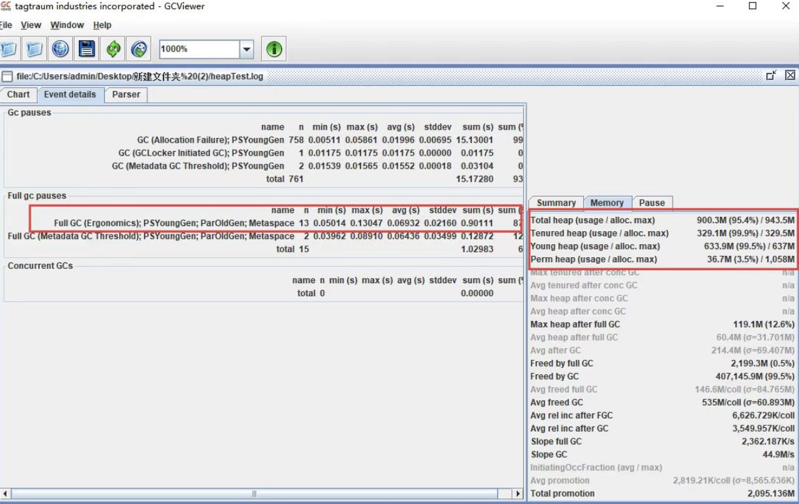

### JVM 内存分配性能问题

JVM 内存分配不合理最直接的表现就是频繁的 GC，这会导致上下文切换等性能问题，从而降低系统的吞吐量、增加系统的响应时间。因此，如果你在线上环境或性能测试时，发现频繁的 GC，且是正常的对象创建和回收，这个时候就需要考虑调整 JVM 内存分配了，从而减少 GC 所带来的性能开销。

#### 对象在堆中的生存周期

对象会被优先分配到新生代的 Eden 区中，这时虚拟机会给对象定义一个对象年龄计数器（通过参数 -XX:MaxTenuringThreshold 设置）。

当 Eden 空间不足时，虚拟机将会执行一个新生代的垃圾回收（Minor GC），这时 JVM 会把存活的对象转移到 Survivor 中，并给对象的年龄 +1，对象在 Survivor 中同样也会经历 MinorGC，每经过一次 MinorGC，对象的年龄将会 +1。

当然了，内存空间也是有设置阈值的，可以通过参数 -XX:PetenureSizeThreshold 设置直接被分配到老年代的最大对象，这时如果分配的对象超过了设置的阀值，对象就会直接被分配到老年代，这样做的好处就是可以减少新生代的垃圾回收。

##### 查看 JVM 堆内存分配

在默认不配置 JVM 堆内存大小的情况下，JVM 根据默认值来配置当前内存大小，我们可以通过以下命令来查看堆内存配置的默认值：
```text
$ java -XX:+PrintFlagsFinal -version | grep HeapSize 

jdk11:
   size_t ErgoHeapSizeLimit                        = 0                                         {product} {default}
   size_t HeapSizePerGCThread                      = 43620760                                  {product} {default}
   size_t InitialHeapSize                          = 268435456                                 {product} {ergonomic}
   size_t LargePageHeapSizeThreshold               = 134217728                                 {product} {default}
   size_t MaxHeapSize                              = 4294967296                                {product} {ergonomic}
    uintx NonNMethodCodeHeapSize                   = 5836300                                {pd product} {ergonomic}
    uintx NonProfiledCodeHeapSize                  = 122910970                              {pd product} {ergonomic}
    uintx ProfiledCodeHeapSize                     = 122910970                              {pd product} {ergonomic}
java version "11.0.6" 2020-01-14 LTS
Java(TM) SE Runtime Environment 18.9 (build 11.0.6+8-LTS)
Java HotSpot(TM) 64-Bit Server VM 18.9 (build 11.0.6+8-LTS, mixed mode)

jdk8:
    uintx ErgoHeapSizeLimit                         = 0                                   {product}
    uintx HeapSizePerGCThread                       = 87241520                            {product}
    uintx InitialHeapSize                          := 268435456                           {product}
    uintx LargePageHeapSizeThreshold                = 134217728                           {product}
    uintx MaxHeapSize                              := 4294967296                          {product}
java version "1.8.0_211"
Java(TM) SE Runtime Environment (build 1.8.0_211-b12)
Java HotSpot(TM) 64-Bit Server VM (build 25.211-b12, mixed mode)

$ jmap -heap pid

```

在 JDK1.7 中，默认情况下年轻代和老年代的比例是 1:2，我们可以通过–XX:NewRatio 重置该配置项。年轻代中的 Eden 和 To Survivor、From Survivor 的比例是 8:1:1，我们可以通过 -XX:SurvivorRatio 重置该配置项。

在 JDK1.7 中如果开启了 -XX:+UseAdaptiveSizePolicy 配置项，JVM 将会动态调整 Java堆中各个区域的大小以及进入老年代的年龄，–XX:NewRatio 和 -XX:SurvivorRatio 将会失效，而 JDK1.8 是默认开启 -XX:+UseAdaptiveSizePolicy 配置项的。

在 JDK1.8 中，不要随便关闭 UseAdaptiveSizePolicy 配置项，除非你已经对初始化堆内存 / 最大堆内存、年轻代 / 老年代以及 Eden 区 /Survivor 区有非常明确的规划了。否则 JVM 将会分配最小堆内存，年轻代和老年代按照默认比例 1:2 进行分配，年轻代中的Eden 和 Survivor 则按照默认比例 8:2 进行分配。这个内存分配未必是应用服务的最佳配置，因此可能会给应用服务带来严重的性能问题。

#### JVM 内存分配的调优过程

现模拟一个抢购接口，假设需要满足一个 5W 的并发请求，且每次请求会产生 20KB对象，可以通过千级并发创建一个 1MB 对象的接口来模拟万级并发请求产生大量对象的场景，具体代码如下：
```text
@RequestMapping(value = "/gc")
public String gc(HttpServletRequest request) {
    List<Byte[]> temp = new ArrayList<Byte[]>();
    Byte[] b = new Byte[1024*1024];
    temp.add(b);
    return "success";
}
```

##### AB 压测

当并发数量到了一定值时，吞吐量就上不去了，响应时间也迅速增加。那么，在JVM 内部运行又是怎样的呢?

##### 分析 GC 日志

可以通过 GC 日志查看具体的回收日志，通过设置 VM 配置参数，将运行期间的 GC 日志 dump 下来，具体配置参数如下：
```text
-XX:+PrintGCTimeStamps -XX:+PrintGCDetails -Xloggc:/log/heapTest.log

以下是各个配置项的说明：
-XX:PrintGCTimeStamps：打印 GC 具体时间；
-XX:PrintGCDetails ：打印出 GC 详细日志；
-Xloggc: path：GC 日志生成路径；
```
收集到 GC 日志后，就可以使用 GCViewer 工具打开它，进而查看到具体的 GC 日志。



主页面显示 FullGC 发生了 13 次，右下角显示年轻代和老年代的内存使用率几乎达到了100%。而 FullGC 会导致 stop-the-world 的发生，从而严重影响到应用服务的性能。此时，需要调整堆内存的大小来减少 FullGC 的发生。

#### 参考指标

GC 频率：高频的 FullGC 会给系统带来非常大的性能消耗，虽然 MinorGC 相对 FullGC 来说好了许多，但过多的 MinorGC 仍会给系统带来压力。

内存：这里的内存指的是堆内存大小，堆内存又分为年轻代内存和老年代内存。首先要分析堆内存大小是否合适，其次是分析年轻代和老年代的比例是否合适。如果内存不足或分配不均匀，会增加 FullGC，严重的将导致 CPU 持续爆满，影响系统性能。

吞吐量：频繁的 FullGC 将会引起线程的上下文切换，增加系统的性能开销，从而影响每次处理的线程请求，最终导致系统的吞吐量下降。

延时：JVM 的 GC 持续时间也会影响到每次请求的响应时间。

#### 具体调优方法

1、调整堆内存空间减少 FullGC：通过日志分析，堆内存基本被用完了，而且存在大量FullGC，这意味着我们的堆内存严重不足，这个时候我们需要调大堆内存空间。

```text
java -jar -Xms4g -Xmx4g heap.jar

以下是各个配置项的说明：
-Xms: 初始堆内存大小
-Xmx: 堆的最大内存大小
```

2、调整年轻代减少 MinorGC：通过调整堆内存大小，已经提升了整体的吞吐量，降低了响应时间。那还有优化空间吗？还可以将年轻代设置得大一些，从而减少一些MinorGC。

```text
java -jar -Xms4g -Xmx4g -Xmn3g heap.jar
```

设置 Eden、Survivor 区比例：在 JVM 中，如果开启 AdaptiveSizePolicy，则每次 GC后都会重新计算 Eden、From Survivor 和 To Survivor 区的大小，计算依据是 GC 过程中统计的 GC 时间、吞吐量、内存占用量，这个时候 SurvivorRatio 默认设置的比例会失效。

在 JDK1.8 中，默认是开启 AdaptiveSizePolicy 的，我们可以通过 -XX:-UseAdaptiveSizePolicy 关闭该项配置，或显示运行 -XX:SurvivorRatio=8 将 Eden、Survivor 的比例设置为 8:2。大部分新对象都是在 Eden 区创建的，我们可以固定 Eden 区的占用比例，来调优 JVM 的内存分配性能。


