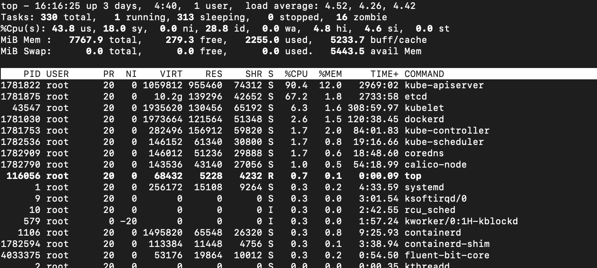

### 常用的监控和诊断内存工具

工欲善其事，必先利其器。平时排查内存性能瓶颈时，往往需要用到一些 Linux 命令行或者 JDK 工具来辅助我们监测系统或者虚拟机内存的使用情况，介绍几种好用且常用的工具。

#### Linux 命令行工具之 top 命令

top 命令是在 Linux 下最常用的命令之一，它可以实时显示正在执行进程的 CPU 使用率、内存使用率以及系统负载等信息。其中上半部分显示的是系统的统计信息，下半部分显示的是进程的使用率统计信息。



top -Hp pid 查看具体线程使用系统资源情况

#### Linux 命令行工具之 vmstat 命令

vmstat 是一款指定采样周期和次数的功能性监测工具，可以看到，它不仅可以统计内存的使用情况，还可以观测到 CPU 的使用率、swap 的使用情况。但 vmstat 一般很少用来查看内存的使用情况，而是经常被用来观察进程的上下文切换。

```text
$ vmstat 1 3  
1 秒钟检查一次，总共检测3次

r：等待运行的进程数；
b：处于非中断睡眠状态的进程数；
swpd：虚拟内存使用情况；
free：空闲的内存；
buff：用来作为缓冲的内存数；
si：从磁盘交换到内存的交换页数量；
so：从内存交换到磁盘的交换页数量；
bi：发送到块设备的块数；
bo：从块设备接收到的块数；
in：每秒中断数；
cs：每秒上下文切换次数；
us：用户 CPU 使用时间；
sy：内核 CPU 系统使用时间；
id：空闲时间；
wa：等待 I/O 时间；
st：运行虚拟机窃取的时间。
```

#### Linux 命令行工具之 pidstat 命令

pidstat 是 Sysstat 中的一个组件，也是一款功能强大的性能监测工具，我们可以通过命令：yum install sysstat 安装该监控组件。

top 和 vmstat 两个命令都是监测进程的内存、CPU 以及 I/O 使用情况，而 pidstat 命令则是深入到线程级别。

通过 pidstat -help 命令，我们可以查看到有以下几个常用的参数来监测线程的性能：
```text
Usage: pidstat [ options ] [ <interval> [ <count> ] ] [ -e <program> <args> ]
Options are:
[ -d ] [ -H ] [ -h ] [ -I ] [ -l ] [ -R ] [ -r ] [ -s ] [ -t ] [ -U [ <username> ] ]
[ -u ] [ -V ] [ -v ] [ -w ] [ -C <command> ] [ -G <process_name> ] [ --human ]
[ -p { <pid> [,...] | SELF | ALL } ] [ -T { TASK | CHILD | ALL } ]

常用参数：
-u：默认的参数，显示各个进程的 cpu 使用情况；
-r：显示各个进程的内存使用情况；
-d：显示各个进程的 I/O 使用情况；
-w：显示每个进程的上下文切换情况；
-p：指定进程号；
-t：显示进程中线程的统计信息。

相关命令（例如 ps 或 jps[java 进程查询工具]）查询到相关进程 ID，再运行以下命令来监测该进程的内存使用情况：

$ jps

$ pidstat -p pid -r 1 3
其中 pidstat 的参数 -p 用于指定进程 ID，-r 表示监控内存的使用情况，1 表示每秒的意思，3 则表示采样次数。

其中显示的几个关键指标的含义是：
Minflt/s：任务每秒发生的次要错误，不需要从磁盘中加载页；
Majflt/s：任务每秒发生的主要错误，需要从磁盘中加载页；
VSZ：虚拟地址大小，虚拟内存使用 KB；
RSS：常驻集合大小，非交换区内存使用 KB。

如果我们需要继续查看该进程下的线程内存使用率，则在后面添加 -t 指令即可：

$ pidstat -p pid -r 1 3 -t
```

Java 是基于 JVM 上运行的，大部分内存都是在 JVM 的用户内存中创建的，所以除了通过以上 Linux 命令来监控整个服务器内存的使用情况之外，更需要知道 JVM中的内存使用情况，JDK 中就自带了很多命令工具可以监测到 JVM 的内存分配以及使用情况。

#### JDK 工具之 jstat 命令

jstat 可以监测 Java 应用程序的实时运行情况，包括堆内存信息以及垃圾回收信息，可以运行 jstat -help 查看一些关键参数信息：

```text
$ jstat -help
Usage: jstat -help|-options
       jstat -<option> [-t] [-h<lines>] <vmid> [<interval> [<count>]]

Definitions:
  <option>      An option reported by the -options option
  <vmid>        Virtual Machine Identifier. A vmid takes the following form:
                     <lvmid>[@<hostname>[:<port>]]
                Where <lvmid> is the local vm identifier for the target
                Java virtual machine, typically a process id; <hostname> is
                the name of the host running the target Java virtual machine;
                and <port> is the port number for the rmiregistry on the
                target host. See the jvmstat documentation for a more complete
                description of the Virtual Machine Identifier.
  <lines>       Number of samples between header lines.
  <interval>    Sampling interval. The following forms are allowed:
                    <n>["ms"|"s"]
                Where <n> is an integer and the suffix specifies the units as 
                milliseconds("ms") or seconds("s"). The default units are "ms".
  <count>       Number of samples to take before terminating.
  -J<flag>      Pass <flag> directly to the runtime system.

$ jstat -options
-class：显示 ClassLoad 的相关信息；
-compiler：显示 JIT 编译的相关信息；
-gc：显示和 gc 相关的堆信息；
-gccapacity：显示各个代的容量以及使用情况；
-gcmetacapacity：显示 Metaspace 的大小；
-gcnew：显示新生代信息；
-gcnewcapacity：显示新生代大小和使用情况；
-gcold：显示老年代和永久代的信息；
-gcoldcapacity ：显示老年代的大小；
-gcutil：显示垃圾收集信息；
-gccause：显示垃圾回收的相关信息（通 -gcutil），同时显示最后一次或当前正在发生的垃圾回收的诱因；
-printcompilation：输出 JIT 编译的方法信息。

jstat 查看堆内存的使用情况，可以用 jstat -gc pid 查看：
$ jstat -gc pid
S0C：年轻代中 To Survivor 的容量（单位 KB）；
S1C：年轻代中 From Survivor 的容量（单位 KB）；
S0U：年轻代中 To Survivor 目前已使用空间（单位 KB）；
S1U：年轻代中 From Survivor 目前已使用空间（单位 KB）；
EC：年轻代中 Eden 的容量（单位 KB）；
EU：年轻代中 Eden 目前已使用空间（单位 KB）；
OC：Old 代的容量（单位 KB）；
OU：Old 代目前已使用空间（单位 KB）；
MC：Metaspace 的容量（单位 KB）；
MU：Metaspace 目前已使用空间（单位 KB）；
YGC：从应用程序启动到采样时年轻代中 gc 次数；
YGCT：从应用程序启动到采样时年轻代中 gc 所用时间 (s)；
FGC：从应用程序启动到采样时 old 代（全 gc）gc 次数；
FGCT：从应用程序启动到采样时 old 代（全 gc）gc 所用时间 (s)；
GCT：从应用程序启动到采样时 gc 用的总时间 (s)。
```

#### JDK 工具之 jstack 命令

这个工具是一种线程堆栈分析工具，最常用的功能就是使用 jstack pid 命令查看线程的堆栈信息，通常会结合 top -Hp pid 或 pidstat -p pid -t 一起查看具体线程的状态，也经常用来排查一些死锁的异常。

每个线程堆栈的信息中，都可以查看到线程 ID、线程的状态（wait、sleep、running 等状态）以及是否持有锁等。

#### JDK 工具之 jmap 命令

使用过 jmap 查看堆内存初始化配置信息以及堆内存的使用情况，还可以使用 jmap 输出堆内存中的对象信息，包括产生了哪些对象，对象数量多少等。

可以用 jmap 来查看堆内存初始化配置信息以及堆内存的使用情况：

```text
$ jmap -heap pid

可以使用 jmap -histo[:live] pid 查看堆内存中的对象数目、大小统计直方图，如果带上 live 则只统计活对象：
$ jmap -histo:live pid | more

可以通过 jmap 命令把堆内存的使用情况 dump 到文件中：
$ jmap -dump:format=b,file=/tmp/heap.hprof pid

利用MAT工具分析堆内存情况
```

### 实战演练

内存溢出问题一般分为两种，一种是由于大峰值下没有限流，瞬间创建大量对象而导致的内存溢出；另一种则是由于内存泄漏而导致的内存溢出。

使用限流，我们一般就可以解决第一种内存溢出问题，但其实很多时候，内存溢出往往是内存泄漏导致的，这种问题就是程序的 BUG，需要及时找到问题代码。

ThreadLocal 的作用是提供线程的私有变量，这种变量可以在一个线程的整个生命周期中传递，可以减少一个线程在多个函数或类中创建公共变量来传递信息，避免了复杂度。但在使用时，如果 ThreadLocal 使用不恰当，就可能导致内存泄漏。

这个案例的场景就是 ThreadLocal，下面创建 100 个线程。运行以下代码，系统一会儿就发送了内存溢出异常：

```text
final static ThreadPoolExecutor poolExecutor = new ThreadPoolExecutor(100, 100, 1, TimeUnit.SECONDS,
        new LinkedBlockingQueue<>());  // 创建线程池，通过线程池，保证创建的线程存活
final static ThreadLocal<Byte[]> localVariable = new ThreadLocal<Byte[]>(); // 声明ThreadLocal信息
@RequestMapping(value = "/test0")
public String test0(HttpServletRequest request) {  
    poolExecutor.execute(new Runnable() {              
        public void run() {  
            Byte[] c = new Byte[4096*1024];                  
            localVariable.set(c);// 为线程添加变量              
        }          
    });
    return "success";
}
@RequestMapping(value = "/test1")
public String test1(HttpServletRequest request) {
    List<Byte[]> temp1 = new ArrayList<Byte[]>();
    Byte[] b = new Byte[1024*20];
    temp1.add(b);// 添加局部变量
    return "success";
}
```

在启动应用程序之前，可以通过 HeapDumpOnOutOfMemoryError 和HeapDumpPath 这两个参数开启堆内存异常日志，通过以下命令启动应用程序：
```text
$ java -jar -Xms1000m -Xmx4000m -XX:+HeapDumpOnOutOfMemoryError -XX:HeapDumpPath=/tmp/heapdump.hprof -Xms1g -Xmx1g -XX:+PrintGCTimeStamps -XX:+PrintGCDetails -Xloggc:/tmp/heapTest.log heap.jar

首先，请求 test0 链接 10000 次，之后再请求 test1 链接 10000 次，这个时候我们请求test1 的接口报异常了

通过日志，我们很好分辨这是一个内存溢出异常。我们首先通过 Linux 系统命令查看进程在整个系统中内存的使用率是多少，最简单就是 top 命令了。

从 top 命令查看进程的内存使用情况，可以发现在机器只有 8G 内存且只分配了 4G 内存给 Java 进程的情况下，Java 进程内存使用率已经达到了 55%，再通过 top -Hp pid 查看具体线程占用系统资源情况。

再通过 jstack pid 查看具体线程的堆栈信息，可以发现该线程一直处于 TIMED_WAITING状态，此时 CPU 使用率和负载并没有出现异常，就可以排除死锁或 I/O 阻塞的异常问题了。

再通过 jmap 查看堆内存的使用情况，可以发现，老年代的使用率几乎快占满了，而且内存一直得不到释放：
$ jmap -heap pid

需要查看具体的堆内存对象，看看是哪个对象占用了堆内存，可以通过 jmap 查看存活对象的数量：
$ jmap -histo:live pid
Byte 对象占用内存明显异常，说明代码中 Byte 对象存在内存泄漏，我们在启动时，已经设置了 dump 文件，通过 MAT 打开 dump 的内存日志文件，我们可以发现 MAT 已经提示了 byte 内存异常.
```


