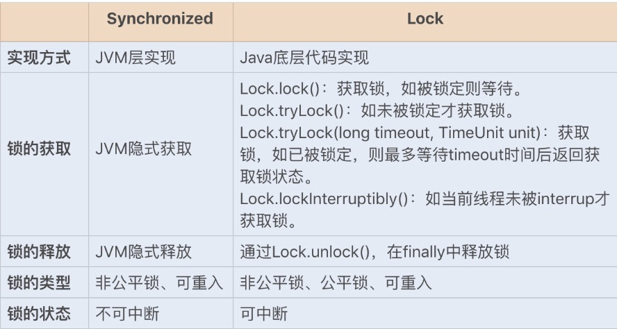

Lock和Synchronized都属于悲观锁

Lock 锁的实现原理

Lock 锁是基于 Java 实现的锁，Lock 是一个接口类，常用的实现类有 ReentrantLock、ReentrantReadWriteLock（RRW），它们都是依赖AbstractQueuedSynchronizer（AQS）类实现的。

AQS 类结构中包含一个基于链表实现的等待队列（CLH 队列），用于存储所有阻塞的线程，AQS 中还有一个 state变量，该变量对 ReentrantLock 来说表示加锁状态。该队列的操作均通过 CAS 操作实现，我们可以通过一张图来看下整个获取锁的流程。

锁分离优化 Lock 同步锁

1. 读写锁 ReentrantReadWriteLock

针对这种读多写少的场景，Java 提供了另外一个实现 Lock接口的读写锁 RRW。我们已知 ReentrantLock 是一个独占锁，同一时间只允许一个线程访问，而 RRW 允许多个读线程同时访问，但不允许写线程和读线程、写线程和写线程同时访问。读写锁内部维护了两个锁，一个是用于读操作的ReadLock，一个是用于写操作的 WriteLock。

RRW 也是基于 AQS 实现的，它的自定义同步器（继承AQS）需要在同步状态 state 上维护多个读线程和一个写线程的状态，该状态的设计成为实现读写锁的关键。RRW 很好地使用了高低位，来实现一个整型控制两种状态的功能，读写锁将变量切分成了两个部分，高 16 位表示读，低 16位表示写。

2. 读写锁再优化之 StampedLock

RRW 被很好地应用在了读大于写的并发场景中，然而 RRW在性能上还有可提升的空间。在读取很多、写入很少的情况下，RRW 会使写入线程遭遇饥饿（Starvation）问题，也就是说写入线程会因迟迟无法竞争到锁而一直处于等待状态。

在 JDK1.8 中，Java 提供了 StampedLock 类解决了这个问题。StampedLock 不是基于 AQS 实现的，但实现的原理和 AQS 是一样的，都是基于队列和锁状态实现的。与RRW 不一样的是，StampedLock 控制锁有三种模式: 写、悲观读以及乐观读，并且 StampedLock 在获取锁时会返回一个票据 stamp，获取的 stamp 除了在释放锁时需要校验，在乐观读模式下，stamp 还会作为读取共享资源后的二次校验。

首先线程会通过乐观锁 tryOptimisticRead 操作获取票据 stamp ，如果当前没有线程持有写锁，则返回一个非 0 的 stamp 版本信息。线程获取该 stamp 后，将会拷贝一份共享资源到方法栈，在这之前具体的操作都是基于方法栈的拷贝数据。

之后方法还需要调用 validate，验证之前调用tryOptimisticRead 返回的 stamp 在当前是否有其它线程持有了写锁，如果是，那么 validate 会返回 0，升级为悲观锁；否则就可以使用该 stamp 版本的锁对数据进行操作。

相比于 RRW，StampedLock 获取读锁只是使用与或操作进行检验，不涉及 CAS 操作，即使第一次乐观锁获取失败，也会马上升级至悲观锁，这样就可以避免一直进行 CAS操作带来的 CPU 占用性能的问题，因此 StampedLock 的效率更高。

StampLock不支持重入，不支持条件变量，线程被中断时可能导致CPU暴涨。

