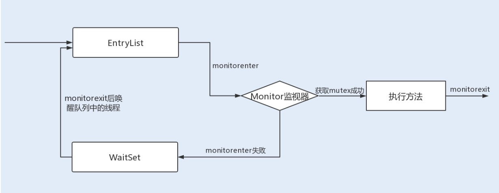
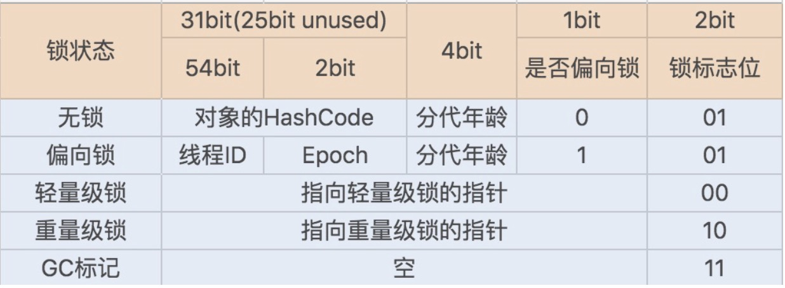
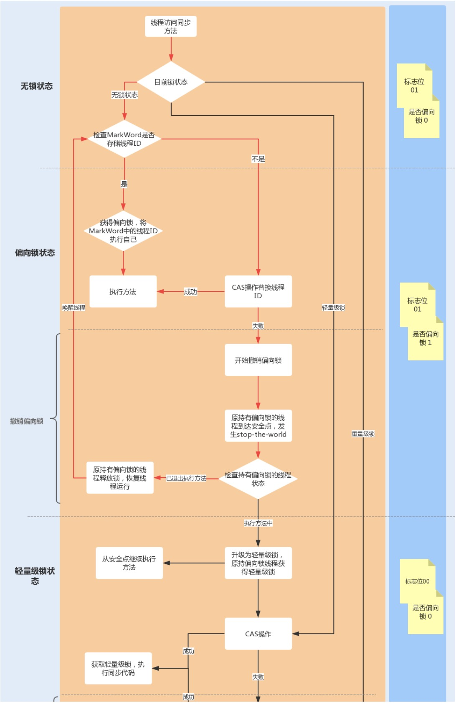
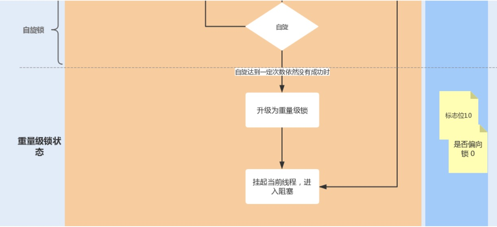

Synchronized 同步锁实现原理

通常 Synchronized 实现同步锁的方式有两种，一种是修饰方法，一种是修饰方法块。以下就是通过 Synchronized 实现的两种同步方法加锁的方式：
```
// 关键字在实例方法上，锁为当前实例
public synchronized void method1() {    
    // code
}
// 关键字在代码块上，锁为括号里面的对象
public void method2() {    
    Object o = new Object();    
    synchronized (o) {        
        // code    
    }
}
```

通过反编译看下具体字节码的实现，运行以下反编译命令，就可以输出相应的字节码信息：
```
// 先运行编译 class 文件命令
javac -encoding UTF-8 SyncTest.java 

// 再通过 javap 打印出字节文件 
javap -v SyncTest.class 

method1编译后：
当 Synchronized 修饰同步方法时，并没有发现 monitorenter 和 monitorexit 指令，而是出现了一个 ACC_SYNCHRONIZED 标志。

public synchronized void method1();    
descriptor: ()V    flags: ACC_PUBLIC, ACC_SYNCHRONIZED // ACC_SYNCHRONIZED 标志    
Code:      
    stack=0, locals=1, args_size=1         
        0: return      
    LineNumberTable:        
        line 8: 0

method2编译后：
通过字节码，会发现：Synchronized 在修饰同步代码块时，是由 monitorenter和 monitorexit 指令来实现同步的。
进入 monitorenter 指令后，线程将持有 Monitor 对象，退出 monitorenter 指令后，线程将释放该 Monitor 对象。
这是因为 JVM 使用了 ACC_SYNCHRONIZED 访问标志来区分一个方法是否是同步方法。当方法调用时，调用指令将会检查该方法是否被设置 ACC_SYNCHRONIZED 访问标志。
如果设置了该标志，执行线程将先持有 Monitor 对象，然后再执行方法。在该方法运行期间，其它线程将无法获取到该 Mointor 对象，当方法执行完成后，再释放该 Monitor 对象

JVM 中的同步是基于进入和退出管程（Monitor）对象实现的。
每个对象实例都会有一个Monitor，Monitor 可以和对象一起创建、销毁。
Monitor 是由 ObjectMonitor 实现，而ObjectMonitor 是由 C++ 的 ObjectMonitor.hpp 文件实现，如下所示：
ObjectMonitor() {   
    _header = NULL;   
    _count = 0; // 记录个数
    _waiters = 0,   _recursions = 0;   
    _object = NULL;   
    _owner = NULL;   
    _WaitSet = NULL; // 处于 wait 状态的线程，会被加入到 _WaitSet   
    _WaitSetLock = 0 ;   
    _Responsible = NULL ;   
    _succ = NULL ;   
    _cxq = NULL ;   
    FreeNext = NULL ;   
    _EntryList = NULL ; // 处于等待锁 block 状态的线程，会被加入到该列表   
    _SpinFreq = 0 ;   
    _SpinClock = 0 ;   
    OwnerIsThread = 0 ;
}

当多个线程同时访问一段同步代码时，多个线程会先被存放在 EntryList 集合中，处于block 状态的线程，都会被加入到该列表。
接下来当线程获取到对象的 Monitor 时，Monitor 是依靠底层操作系统的 Mutex Lock 来实现互斥的，线程申请 Mutex 成功，则持有该 Mutex，其它线程将无法获取到该 Mutex。

如果线程调用 wait() 方法，就会释放当前持有的 Mutex，并且该线程会进入 WaitSet 集合中，等待下一次被唤醒。如果当前线程顺利执行完方法，也将释放 Mutex。

```


总结来说就是，同步锁在这种实现方式中，因 Monitor 是依赖于底层的操作系统实现，存在用户态与内核态之间的切换，所以增加了性能开销。

锁升级优化

为了提升性能，JDK1.6 引入了偏向锁、轻量级锁、重量级锁概念，来减少锁竞争带来的上下文切换，而正是新增的 Java 对象头实现了锁升级功能，当 Java 对象被 Synchronized 关键字修饰成为同步锁后，围绕这个锁的一系列升级操作都将和 Java 对象头有关。

Java 对象头

在 JDK1.6 JVM 中，对象实例在堆内存中被分为了三个部分：对象头、实例数据和对齐填充。

其中 Java 对象头由 Mark Word、指向类的指针以及数组长度三部分组成，Mark Word 记录了对象和锁有关的信息，Mark Word 在 64 位 JVM 中的长度是 64bit，64 位 JVM 的存储结构如下图所示：


锁升级功能主要依赖于 Mark Word 中的锁标志位和释放偏向锁标志位，Synchronized 同步锁就是从偏向锁开始的，随着竞争越来越激烈，偏向锁升级到轻量级锁，最终升级到重量级锁。

1. 偏向锁

偏向锁主要用来优化同一线程多次申请同一个锁的竞争。在某些情况下，大部分时间是同一个线程竞争锁资源，例如，在创建一个线程并在线程中执行循环监听的场景下，或单线程操作一个线程安全集合时，同一线程每次都需要获取和释放锁，每次操作都会发生用户态与内核态的切换。

偏向锁的作用就是，当一个线程再次访问这个同步代码或方法时，该线程只需去对象头的Mark Word 中去判断一下是否有偏向锁指向它的 ID，无需再进入 Monitor 去竞争对象了。当对象被当做同步锁并有一个线程抢到了锁时，锁标志位还是 01，“是否偏向锁”标志位设置为 1，并且记录抢到锁的线程 ID，表示进入偏向锁状态。

一旦出现其它线程竞争锁资源时，偏向锁就会被撤销。偏向锁的撤销需要等待全局安全点，暂停持有该锁的线程，同时检查该线程是否还在执行该方法，如果是，则升级锁，反之则被其它线程抢占




在高并发场景下，当大量线程同时竞争同一个锁资源时，偏向锁就会被撤销，发生stop the word 后， 开启偏向锁无疑会带来更大的性能开销，这时我们可以通过添加 JVM参数关闭偏向锁来调优系统性能，示例代码如下：
```
// 关闭偏向锁（默认打开）
-XX:-UseBiasedLocking 
或者
// 设置重量级锁
-XX:+UseHeavyMonitors  
```

2. 轻量级锁

当有另外一个线程竞争获取这个锁时，由于该锁已经是偏向锁，当发现对象头 Mark Word中的线程 ID 不是自己的线程 ID，就会进行 CAS 操作获取锁，如果获取成功，直接替换Mark Word 中的线程 ID 为自己的 ID，该锁会保持偏向锁状态；如果获取锁失败，代表当前锁有一定的竞争，偏向锁将升级为轻量级锁。

轻量级锁适用于线程交替执行同步块的场景，绝大部分的锁在整个同步周期内都不存在长时间的竞争。

3. 自旋锁与重量级锁

轻量级锁 CAS 抢锁失败，线程将会被挂起进入阻塞状态。如果正在持有锁的线程在很短的时间内释放资源，那么进入阻塞状态的线程无疑又要申请锁资源。

JVM 提供了一种自旋锁，可以通过自旋方式不断尝试获取锁，从而避免线程被挂起阻塞。这是基于大多数情况下，线程持有锁的时间都不会太长，毕竟线程被挂起阻塞可能会得不偿失。

从 JDK1.7 开始，自旋锁默认启用，自旋次数由 JVM 设置决定，这里我不建议设置的重试次数过多，因为 CAS 重试操作意味着长时间地占用 CPU。

自旋锁重试之后如果抢锁依然失败，同步锁就会升级至重量级锁，锁标志位改为 10。在这个状态下，未抢到锁的线程都会进入 Monitor，之后会被阻塞在 _WaitSet 队列中。

在锁竞争不激烈且锁占用时间非常短的场景下，自旋锁可以提高系统性能。一旦锁竞争激烈或锁占用的时间过长，自旋锁将会导致大量的线程一直处于 CAS 重试状态，占用 CPU 资源，反而会增加系统性能开销。所以自旋锁和重量级锁的使用都要结合实际场景。

在高负载、高并发的场景下，我们可以通过设置 JVM 参数来关闭自旋锁，优化系统性能，示例代码如下：
```
// 参数关闭自旋锁优化 (默认打开)
-XX:-UseSpinning  

// 参数修改默认的自旋次数。JDK1.7 后，去掉此参数，由 jvm 控制
-XX:PreBlockSpin 
```

动态编译实现锁消除 / 锁粗化

除了锁升级优化，Java 还使用了编译器对锁进行优化，JIT 编译器在动态编译同步块的时候，借助了一种被称为逃逸分析的技术，来判断同步块使用的锁对象是否只能够被一个线程访问，而没有被发布到其它线程。

确认是的话，那么 JIT 编译器在编译这个同步块的时候不会生成 synchronized 所表示的锁的申请与释放的机器码，即消除了锁的使用。在 Java7 之后的版本就不需要手动配置了，该操作可以自动实现。

锁粗化同理，就是在 JIT 编译器动态编译时，如果发现几个相邻的同步块使用的是同一个锁实例，那么 JIT 编译器将会把这几个同步块合并为一个大的同步块，从而避免一个线程“反复申请、释放同一个锁“所带来的性能开销。

减小锁粒度

除了锁内部优化和编译器优化之外，我们还可以通过代码层来实现锁优化，减小锁粒度就是一种惯用的方法。

最经典的减小锁粒度的案例就是 JDK1.8 之前实现的 ConcurrentHashMap 版本。我们知道，HashTable 是基于一个数组 + 链表实现的，所以在并发读写操作集合时，存在激烈的锁资源竞争，也因此性能会存在瓶颈。而 ConcurrentHashMap 就很很巧妙地使用了分段锁 Segment 来降低锁资源竞争，如下图所示：


JVM 在 JDK1.6 中引入了分级锁机制来优化 Synchronized，当一个线程获取锁时，首先对象锁将成为一个偏向锁，这样做是为了优化同一线程重复获取导致的用户态与内核态的切换问题；其次如果有多个线程竞争锁资源，锁将会升级为轻量级锁，它适用于在短时间内持有锁，且分锁有交替切换的场景；偏向锁还使用了自旋锁来避免线程用户态与内核态的频繁切换，大大地提高了系统性能；但如果锁竞争太激烈了，那么同步锁将会升级为重量级锁。

减少锁竞争，是优化 Synchronized 同步锁的关键。我们应该尽量使 Synchronized 同步锁处于轻量级锁或偏向锁，这样才能提高 Synchronized 同步锁的性能；通过减小锁粒度来降低锁竞争也是一种最常用的优化方法；另外我们还可以通过减少锁的持有时间来提高Synchronized 同步锁在自旋时获取锁资源的成功率，避免 Synchronized 同步锁升级为重量级锁。


