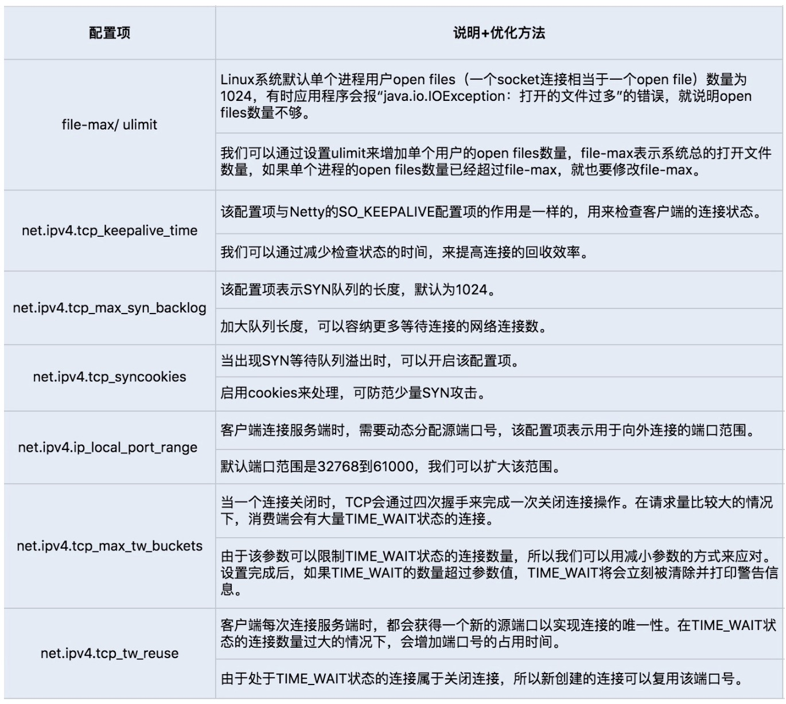

TCP 参数配置项，提高网络吞吐量，Netty 可以基于 ChannelOption 来设置这些参数。

TCP_NODELAY：TCP_NODELAY 选项是用来控制是否开启 Nagle 算法。Nagle 算法通过缓存的方式将小的数据包组成一个大的数据包，从而避免大量的小数据包发送阻塞网络，提高网络传输的效率。我们可以关闭该算法，优化对于时延敏感的应用场景。

SO_RCVBUF 和 SO_SNDBUF：可以根据场景调整套接字发送缓冲区和接收缓冲区的大小。

SO_BACKLOG：backlog 参数指定了客户端连接请求缓冲队列的大小。服务端处理客户端连接请求是按顺序处理的，所以同一时间只能处理一个客户端连接，当有多个客户端进来的时候，服务端就会将不能处理的客户端连接请求放在队列中等待处理。

SO_KEEPALIVE：当设置该选项以后，连接会检查长时间没有发送数据的客户端的连接状态，检测到客户端断开连接后，服务端将回收该连接。我们可以将该时间设置得短一些，来提高回收连接的效率。

如果 RPC 是基于 TCP 短连接实现的，我们可以通过修改 Linux TCP 配置项来优化网络通信。
```
通过 sysctl -a | grep net.xxx 命令运行查看 Linux 系统默认的的 TCP 参数设置，如果需要修改某项配置，可以通过编辑 vim/etc/sysctl.conf，加入需要修改的配置项， 
并通过 sysctl -p 命令运行生效修改后的配置项设置，通常我们会通过修改以下几个配置项来提高网络吞吐量和降低延时：
```



