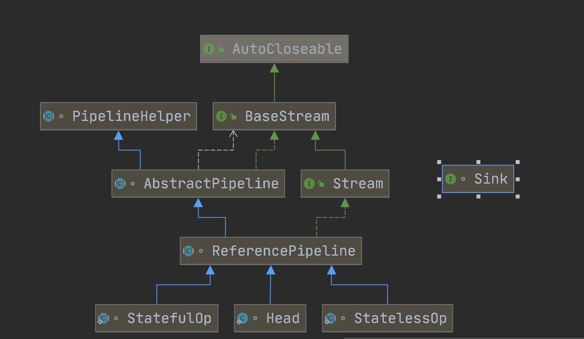

### java.util.stream.Stream API
```
Java8 中添加了一个新的接口类 Stream，他和我们之前接触的字节流概念不太一样，Java8 集合中的 Stream 相当于高级版的 Iterator，
他可以通过 Lambda 表达式对集合进行各种非常便利、高效的聚合操作（Aggregate Operation），或者大批量数据操作 (BulkData Operation)。

Stream 的聚合操作与数据库 SQL 的聚合操作 sorted、filter、map 等类似。
在应用层就可以高效地实现类似数据库 SQL 的聚合操作了，而在数据操作方面，Stream 不仅可以通过串行的方式实现数据操作，还可以通过并行的方式处理大批量数据，提高数据的处理效率。

```

### Stream 中的两大操作 ：中间操作（Intermediate operations）和 终结操作（Terminal operations）
```
中间操作只对操作进行了记录，即只会返回一个流，不会进行计算操作，而终结操作是实现了计算操作。

中间操作又可以分为无状态（Stateless）与有状态（Stateful）操作，前者是指元素的处理不受之前元素的影响，后者是指该操作只有拿到所有元素之后才能继续下去。

终结操作又可以分为短路（Short-circuiting）与 非短路（Unshort-circuiting）操作，前者是指遇到某些符合条件的元素就可以得到最终结果，后者是指必须处理完所有元素才能得到最终结果。

Stream:
{
    中间操作（Intermediate operations）:
        {
            无状态（Stateless）:
                {
                    unordered()
                    filter()
                    map()
                    peek()
                    ...
                }
            有状态（Stateful）:
                {
                    distinct()
                    sorted()
                    limit()
                    skip() 
                }
        }
    终结操作（Terminal operations）:
        {
            短路（Short-circuiting）:
                {
                    anyMatch()
                    allMatch()
                    findFirst()
                    findAny()
                    noneMatch()
                }
            非短路（Unshort-circuiting）:
                {
                    forEach()
                    forEachOrdered()
                    toArray()
                    reduce()
                    collect()
                    max()
                    min()
                    count()
                }
        }
}

中间操作称为懒操作，也正是由这种懒操作结合终结操作、数据源构成的处理管道（Pipeline），实现了 Stream 的高效。
```

### Stream 继承关系图



