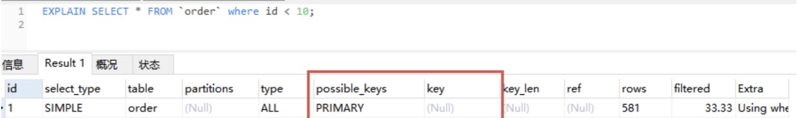
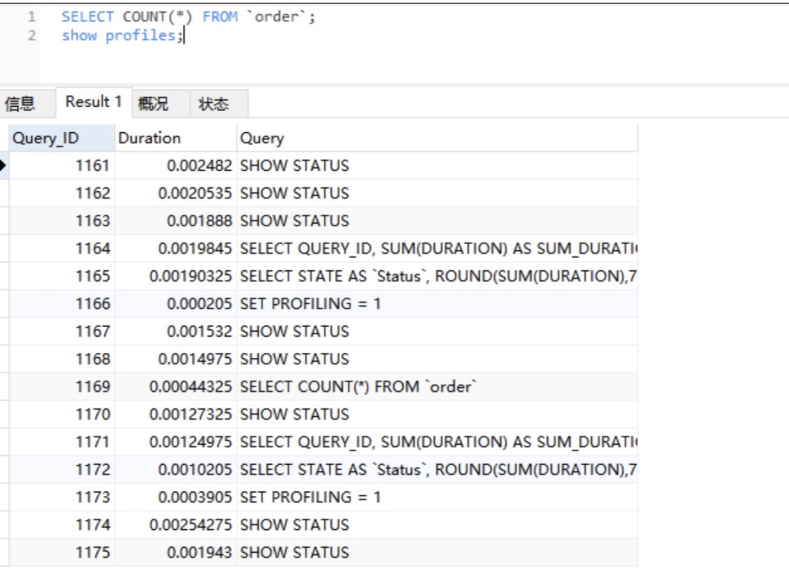
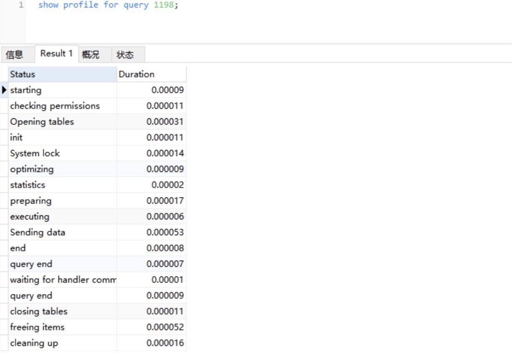
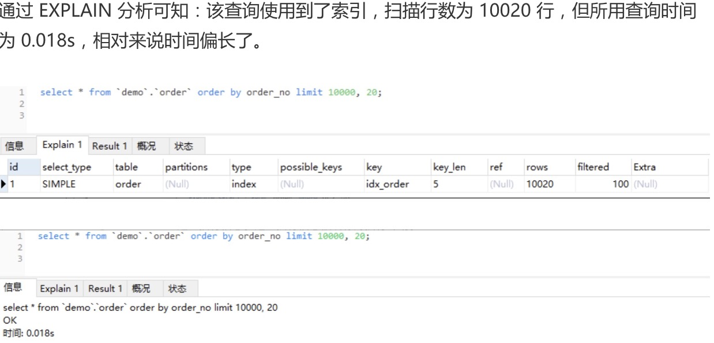
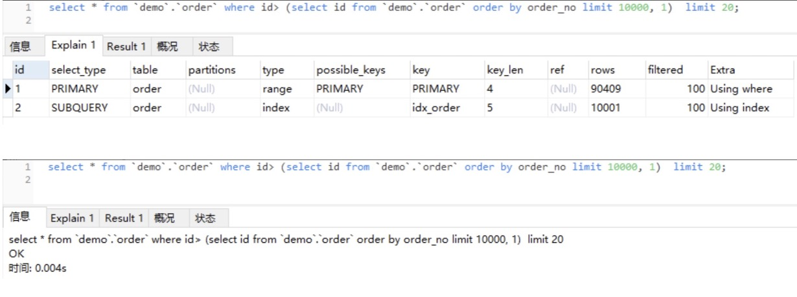

### 慢 SQL 语句的几种常见诱因

#### 无索引、索引失效导致慢查询
```text
如果在一张几千万数据的表中以一个没有索引的列作为查询条件，大部分情况下查询会非常耗时，这种查询毫无疑问是一个慢 SQL 查询，所以对于大数据量的查询，需要建立适合的索引来优化查询。

虽然很多时候建立了索引，但在一些特定的场景下，索引还有可能会失效，所以索引失效也是导致慢查询的主要原因之一。
```

#### 锁等待
```text
常用的存储引擎有 InnoDB 和 MyISAM，前者支持行锁和表锁，后者只支持表锁。

如果数据库操作是基于表锁实现的，一张订单表在更新时，需要锁住整张表，那么其它大量数据库操作（包括查询）都将处于等待状态，这将严重影响到系统的并发性能。

InnoDB 存储引擎支持的行锁更适合高并发场景，但在使用 InnoDB 存储引擎时，要特别注意行锁升级为表锁的可能，在批量更新操作时，行锁就很可能会升级为表锁。

MySQL 认为如果对一张表使用大量行锁，会导致事务执行效率下降，从而可能造成其它事务长时间锁等待和更多的锁冲突问题发生，致使性能严重下降，所以 MySQL 会将行锁升级为表锁。

行锁是基于索引加的锁，如果我们在更新操作时，条件索引失效，那么行锁也会升级为表锁。

基于表锁的数据库操作，会导致 SQL 阻塞等待，从而影响执行速度，在一些更新操作（insert\update\delete）大于或等于读操作的情况下，MySQL 不建议使用 MyISAM存储引擎。
```

#### 不恰当的 SQL 语句
```text
使用不恰当的 SQL 语句也是慢 SQL 最常见的诱因之一，例如，习惯使用 <SELECT *>，<SELECT COUNT(*)> SQL 语句，在大数据表中使用 <LIMIT M,N> 分页查询，以及对非索引字段进行排序等等。
```

#### 通过 EXPLAIN 分析 SQL 执行计划

使用 EXPLAIN 命令查看当前 SQL 是否使用了索引，先通过 SQL EXPLAIN导出相应的执行计划如下：



```text
下面对图示中的每一个字段进行一个说明，从中你也能收获到很多零散的知识点：

id：每个执行计划都有一个 id，如果是一个联合查询，这里还将有多个 id。

select_type：表示 SELECT 查询类型，常见的有 SIMPLE（普通查询，即没有联合查询、子查询）、PRIMARY（主查询）、UNION（UNION 中后面的查询）、SUBQUERY（子查询）等。

table：当前执行计划查询的表，如果给表起别名了，则显示别名信息。

partitions：访问的分区表信息。

type：表示从表中查询到行所执行的方式，查询方式是 SQL 优化中一个很重要的指标，结果值从好到差依次是：system > const > eq_ref > ref > range > index > ALL。

    system/const：表中只有一行数据匹配，此时根据索引查询一次就能找到对应的数据。如果是 B + 树索引，知道此时索引构造成了多个层级的树，当查询的索引在树的底层时，查询效率就越低，const 表示此时索引在第一层，只需访问一层便能得到数据。
    
    eq_ref：使用唯一索引扫描，常见于多表连接中使用主键和唯一索引作为关联条件。
    
    ref：非唯一索引扫描，还可见于唯一索引最左原则匹配扫描。
    
    range：索引范围扫描，比如，<，>，between 等操作。
    
    index：索引全表扫描，此时遍历整个索引树。

    ALL：表示全表扫描，需要遍历全表来找到对应的行。

possible_keys：可能使用到的索引。

key：实际使用到的索引。

key_len：当前使用的索引的长度。

ref：关联 id 等信息。

rows：查找到记录所扫描的行数。

filtered：查找到所需记录占总扫描记录数的比例。

Extra：额外的信息。
```

#### 通过 Show Profile 分析 SQL 执行性能

EXPLAIN 分析执行计划，仅仅是停留在分析 SQL 的外部的执行情况，如果想要深入到 MySQL 内核中，从执行线程的状态和时间来分析的话，这个时候就可以选择 Profile。

Profile 除了可以分析执行线程的状态和时间，还支持进一步选择 ALL、CPU、MEMORY、BLOCK IO、CONTEXT SWITCHES 等类型来查询 SQL 语句在不同系统资源上所消耗的时间，以下是相关命令的注释：
```text
SHOW PROFILE [type [, type] ... ]
[FOR QUERY n]
[LIMIT row_count [OFFSET offset]]

type 参数：
    | ALL：显示所有开销信息
    | BLOCK IO：阻塞的输入输出次数
    | CONTEXT SWITCHES：上下文切换相关开销信息
    | CPU：显示 CPU 的相关开销信息
    | IPC：接收和发送消息的相关开销信息
    | MEMORY ：显示内存相关的开销，目前无用
    | PAGE FAULTS ：显示页面错误相关开销信息
    | SOURCE ：列出相应操作对应的函数名及其在源码中的调用位置 (行数)
    | SWAPS：显示 swap 交换次数的相关开销信息  
```

MySQL 是在 5.0.37 版本之后才支持 Show Profile 功能的，如果你不太确定的话，可以通过 select @@have_profiling 查询是否支持该功能。

最新的 MySQL 版本是默认开启 Show Profile 功能的，但在之前的旧版本中是默认关闭该功能的，可以通过 set 语句在 Session 级别开启该功能。

Show Profiles 只显示最近发给服务器的 SQL 语句，默认情况下是记录最近已执行的 15条记录，可以重新设置 profiling_history_size 增大该存储记录，最大值为 100。



获取到 Query_ID 之后，再通过 Show Profile for Query ID 语句，就能够查看到对应Query_ID 的 SQL 语句在执行过程中线程的每个状态所消耗的时间了：



通过以上分析可知：SELECT COUNT(*) FROM `order`; SQL 语句在 Sending data 状态所消耗的时间最长，这是因为在该状态下，MySQL 线程开始读取数据并返回到客户端，此时有大量磁盘 I/O 操作。

### 常用的 SQL 优化

#### 优化分页查询

通常使用 <LIMIT M,N> + 合适的 order by 来实现分页查询，这种实现方式在没有任何索引条件支持的情况下，需要做大量的文件排序操作（file sort），性能将会非常得糟糕，如果有对应的索引，通常刚开始的分页查询效率会比较理想，但越往后，分页查询的性能就越差。

这是因为在使用 LIMIT 的时候，偏移量 M 在分页越靠后的时候，值就越大，数据库检索的数据也就越多。例如 LIMIT 10000,10 这样的查询，数据库需要查询 10010 条记录，最后返回 10 条记录，也就是说将会有 10000 条记录被查询出来没有被使用到。

模拟一张 10 万数量级的 order 表，进行以下分页查询：

```sql
select * from `order` order by order_no limit 10000, 20
```

通过 EXPLAIN 分析可知：该查询使用到了索引，扫描行数为 10020 行，但所用查询时间为 0.018s，相对来说时间偏长了。



利用子查询优化分页查询，以上分页查询的问题在于，查询获取的 10020 行数据结果都返回给我们了，能否先查询出所需要的 20 行数据中的最小 ID 值，然后通过偏移量返回所需要的 20 行数据呢？可以通过索引覆盖扫描，使用子查询的方式来实现分页查询：

```sql
select * from `order` where id > (select id from `order` order by order_no limit 100000,1) limit 20
```

通过 EXPLAIN 分析可知：子查询遍历索引的范围跟上一个查询差不多，而主查询扫描了更多的行数，但执行时间却减少了，只有 0.004s。这就是因为返回行数只有 20 行了，执行效率得到了明显的提升。



#### 优化 SELECT COUNT(*)

COUNT() 是一个聚合函数，主要用来统计行数，有时候也用来统计某一列的行数量（不统计 NULL 值的行）。平时最常用的就是 COUNT(*) 和 COUNT(1) 这两种方式了，其实两者没有明显的区别，在拥有主键的情况下，都是利用主键列实现了行数的统计。

但 COUNT() 函数在 MyISAM 和 InnoDB 存储引擎所执行的原理是不一样的，通常在没有任何查询条件下的 COUNT(*)，MyISAM 的查询速度要明显快于 InnoDB。

这是因为 MyISAM 存储引擎记录的是整个表的行数，在 COUNT(*) 查询操作时无需遍历表计算，直接获取该值即可，而在 InnoDB 存储引擎中就需要扫描表来统计具体的行数，而当带上 where 条件语句之后，MyISAM 跟 InnoDB 就没有区别了，都需要扫描表来进行行数的统计。

如果对一张大表经常做 SELECT COUNT(*) 操作，这肯定是不明智的。那么该如何对大表的 COUNT() 进行优化呢？ 

近似值：有时候某些业务场景并不需要返回一个精确的 COUNT 值，此时可以使用近似值来代替，可以使用 EXPLAIN 对表进行估算，要知道，执行 EXPLAIN 并不会真正去执行查询，而是返回一个估算的近似值。  

增加汇总统计：如果需要一个精确的 COUNT 值，我们可以额外新增一个汇总统计表或者缓存字段来统计需要的 COUNT 值，这种方式在新增和删除时有一定的成本，但却可以大大提升 COUNT()性能。

#### 优化 SELECT *

MySQL 常用的存储引擎有 MyISAM 和 InnoDB，其中 InnoDB 在默认创建主键时会创建主键索引，而主键索引属于聚族索引，即在存储数据时，索引是基于 B + 树构成的，具体的行数据则存储在叶子节点。

而 MyISAM 默认创建的主键索引、二级索引以及 InnoDB 的二级索引都属于非聚族索引，即在存储数据时，索引是基于 B + 树构成的，而叶子节点存储的是主键值。

假设订单表是基于 InnoDB 存储引擎创建的，且存在 order_no、status 两列组成的组合索引。此时，需要根据订单号查询一张订单表的 status，如果我们使用 select *from order where order_no='xxx’来查询，则先会查询组合索引，通过组合索引获取到主键 ID，再通过主键 ID 去主键索引中获取对应行所有列的值。

如果使用 select order_no, status from order where order_no='xxx’来查询，则只会查询组合索引，通过组合索引获取到对应的 order_no 和 status 的值。

### 慢sql监控

在开发中，要尽量写出高性能的 SQL 语句，但也无法避免一些慢 SQL 语句的出现，或因为疏漏，或因为实际生产环境与开发环境有所区别，这些都是诱因，面对这种情况，可以打开慢 SQL 配置项，记录下都有哪些 SQL 超过了预期的最大执行时间。

首先，可以通过以下命令行查询是否开启了记录慢 SQL 的功能，以及最大的执行时间是多少：
```text
Show variables like 'slow_query%';
Show variables like 'long_query_time';
```

没有开启，可以通过以下设置来开启：
```text
set global slow_query_log='ON';     // 开启慢 SQL 日志
set global slow_query_log_file='/var/lib/mysql/test-slow.log';  // 记录日志地址
set global long_query_time=1;   // 最大执行时间
```


