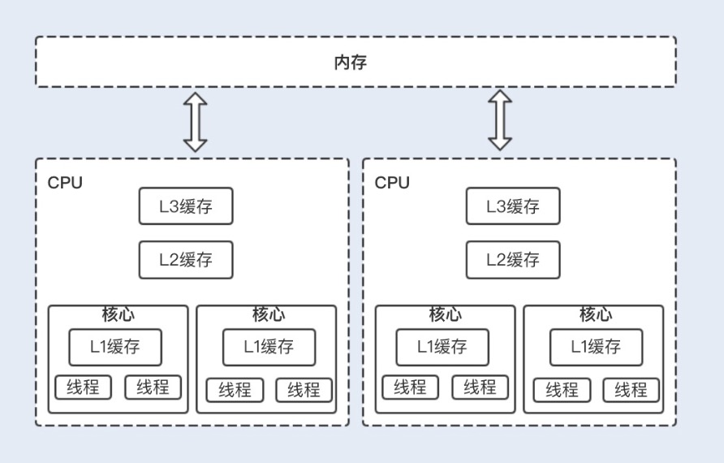
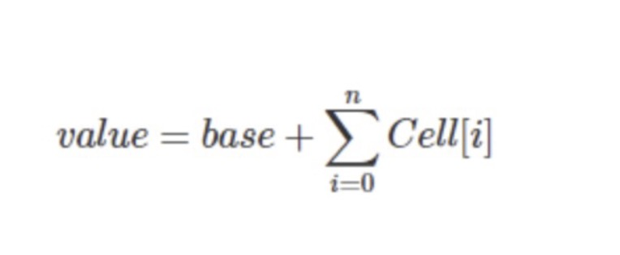

什么是乐观锁

乐观锁，顾名思义，就是说在操作共享资源时，它总是抱着乐观的态度进行，它认为自己可以成功地完成操作。

但实际上，当多个线程同时操作一个共享资源时，只有一个线程会成功，那么失败的线程呢？它们不会像悲观锁一样在操作系统中挂起，而仅仅是返回，并且系统允许失败的线程重试，也允许自动放弃退出操作。所以，乐观锁相比悲观锁来说，不会带来死锁、饥饿等活性故障问题，线程间的相互影响也远远比悲观锁要小。更为重要的是，乐观锁没有因竞争造成的系统开销，所以在性能上也是更胜一筹。

乐观锁的实现原理

CAS 是实现乐观锁的核心算法，它包含了 3 个参数：V（需要更新的变量）、E（预期值）和 N（最新值）。

只有当需要更新的变量等于预期值时，需要更新的变量才会被设置为最新值，如果更新值和预期值不同，则说明已经有其它线程更新了需要更新的变量，此时当前线程不做操作，返回 V 的真实值。

1.CAS 如何实现原子操作

在 JDK 中的 concurrent 包中，atomic 路径下的类都是基于 CAS 实现的。AtomicInteger 就是基于 CAS 实现的一个线程安全的整型类。

AtomicInteger 的自增方法getAndIncrement 是用了 Unsafe 的 getAndAddInt 方法，显然 AtomicInteger 依赖于本地方法 Unsafe 类，Unsafe 类中的操作方法会调用 CPU 底层指令实现原子操作。
```
/**
 * Atomically increments by one the current value.
 *
 * @return the previous value
 */
public final int getAndIncrement() {
    return unsafe.getAndAddInt(this, valueOffset, 1);
}

/**
 * Atomically decrements by one the current value.
 *
 * @return the previous value
 */
public final int getAndDecrement() {
    return unsafe.getAndAddInt(this, valueOffset, -1);
}

/**
 * Atomically sets the value to the given updated value
 * if the current value {@code ==} the expected value.
 *
 * @param expect the expected value
 * @param update the new value
 * @return {@code true} if successful. False return indicates that
 * the actual value was not equal to the expected value.
 */
public final boolean compareAndSet(int expect, int update) {
    return unsafe.compareAndSwapInt(this, valueOffset, expect, update);
}
```

2. 处理器如何实现原子操作

CAS 是调用处理器底层指令来实现原子操作，处理器和物理内存之间的通信速度要远慢于处理器间的处理速度，所以处理器有自己的内部缓存。如下图所示，在执行操作时，频繁使用的内存数据会缓存在处理器的 L1、L2 和L3 高速缓存中，以加快频繁读取的速度：


但现在的服务器通常是多处理器，并且每个处理器都是多核的。每个处理器维护了一块字节的内存，每个内核维护了一块字节的缓存，这时候多线程并发就会存在缓存不一致的问题，从而导致数据不一致。

这个时候，处理器提供了总线锁定和缓存锁定两个机制来保证复杂内存操作的原子性。

当处理器要操作一个共享变量的时候，其在总线上会发出一个 Lock 信号，这时其它处理器就不能操作共享变量了，该处理器会独享此共享内存中的变量。但总线锁定在阻塞其它处理器获取该共享变量的操作请求时，也可能会导致大量阻塞，从而增加系统的性能开销。

于是，后来的处理器都提供了缓存锁定机制，也就说当某个处理器对缓存中的共享变量进行了操作，就会通知其它处理器放弃存储该共享资源或者重新读取该共享资源。目前最新的处理器都支持缓存锁定机制。

优化 CAS 乐观锁

虽然乐观锁在并发性能上要比悲观锁优越，但是在写大于读的操作场景下，CAS 失败的可能性会增大，如果不放弃此次CAS 操作，就需要循环做 CAS 重试，这无疑会长时间地占用 CPU。

在 Java7 中，AtomicInteger的 getAndSet 方法中使用了 for 循环不断重试 CAS 操作，如果长时间不成功，就会给 CPU 带来非常大的执行开销。到了 Java8，for 循环虽然被去掉了，但我们反编译 Unsafe类时就可以发现该循环其实是被封装在了 Unsafe 类中，CPU 的执行开销依然存在。

在 JDK1.8 中，Java 提供了一个新的原子类 LongAdder。LongAdder 在高并发场景下会比 AtomicInteger 和AtomicLong 的性能更好，代价就是会消耗更多的内存空间。

LongAdder 的原理就是降低操作共享变量的并发数，也就是将对单一共享变量的操作压力分散到多个变量值上，将竞争的每个写线程的 value 值分散到一个数组中，不同线程会命中到数组的不同槽中，各个线程只对自己槽中的 value 值进行 CAS 操作，最后在读取值的时候会将原子操作的共享变量与各个分散在数组的 value 值相加，返回一个近似准确的数值。

LongAdder 内部由一个 base 变量和一个 cell[] 数组组成。当只有一个写线程，没有竞争的情况下，LongAdder会直接使用 base 变量作为原子操作变量，通过 CAS 操作修改变量；当有多个写线程竞争的情况下，除了占用 base变量的一个写线程之外，其它各个线程会将修改的变量写入到自己的槽 cell[] 数组中，最终结果可通过以下公式计算得出：



LongAdder 在操作后的返回值只是一个近似准确的数值，但是 LongAdder 最终返回的是一个准确的数值， 所以在一些对实时性要求比较高的场景下，LongAdder 并不能取代 AtomicInteger 或 AtomicLong。


